# **늘비상담 (늘 함께 하는 비대면 상담)**

## 한 줄 소개

### **`자신의 말 못 할 고민을 자신의 개성을 드러낸 캐릭터를 통해 익명으로 자유롭게 소통하기 위한 힐링 웹 서비스`**

<br/>


<br/><br/>

## 기획 의도
### 1. 사람들은 누구나 자신만의 고민을 안고 살아갑니다.

<br/>

### 2. 방송을 보더라도 고민상담에 대한 프로그램은 꾸준히 인기를 끌고 있므여 이를 통해 사람들의 니즈가 확실한 분야라는 것을 알 수 있습니다.

<br/>

### 3. 하지만, 가벼운 고민을 토로하려고 심리 상담소를 찾기는 어렵습니다. 심리상담소는 고민을 토로하러 가는 것 보단, 우울증을 겪고 있는 사람들이 심리치료를 위한 목적성이 더 강합니다.

<br/>

### 4. 가까운 친구, 가족에게 고민을 털어놓으면 되지 않을까? 하지만, 가까운 사람들이기에 말하기 힘든 고민도 있을 것 입니다.

<br/>

### 5. 이런 ***다양한 고민들을 익명성을 보장한 고민 토로장***을 만들어주면 어떨까? 라는 아이디어에서 기획하게 된 서비스 입니다.

<br/><br/>


## 프로젝트 특장점
- 익명성을 통하여 자신의 고민을 자유롭게 나눌 수 있는 서비스 구현
- 서로가 서로에게 상담사가 되어 각자의 경험에 기반한 상담을 받을 수 있는 서비스 구현
- 자신의 경험을 한 눈에 알아볼 수 있는 서비스 구현
- 사용자 친화적인 부드러운 UI / UX 구현

<br/><br/>

## 프로젝트 차별성
- ‘상담’이란 다소 무거운 이미지를 가볍게 풀어낸다.
- 자신만의 캐릭터를 통해 익명성을 보장하되, 자신만의 개성을 드러낸 채 이야기를 나눌 수 있다.
- 심적 안정감을 주는 블루 계열의 색채 사용
- 부드러운 디자인과 자유로운 커뮤니티 사이트

<br/><br/><br/>

# 팀 구성
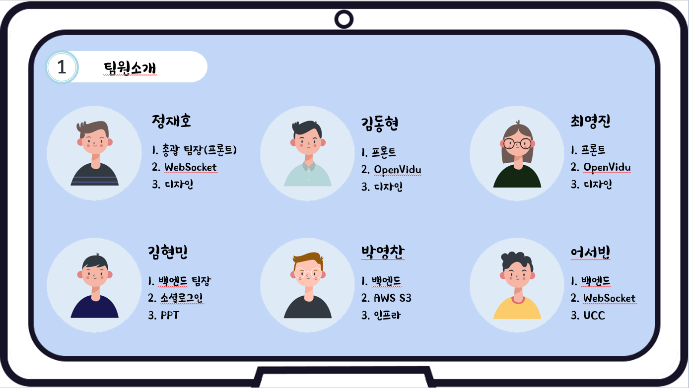
## 프로젝트 진행기간
- 2022.01.10 ~ 2022.02.18 (6주)

<br/>

## Front-End
- 정재호 : 총괄 팀장(프론트) + WebSocket(SockJS + STOMP) + 디자인 + 발표
- 김동현 : 프론트 + OpenVidu + 디자인
- 최영진 : 프론트 + OpenVidu + 디자인

<br>  

## Back-End
- 김현민 : 백엔드 팀장 + 소셜 로그인(OAuth2.0) + PPT
- 박영찬 : 백엔드 + 인프라 + AWS S3
- 어서빈 : 백엔드 + WebSocket(SockJS + STOMP) + UCC

<br>

## 주요 협업 툴
- Jira
- MatterMost
- GitLap
- Notion
  - https://light-caption-620.notion.site/17ad9e539b0249ebabb1b8e9331aa460

<br/><br/><br/>

# 주요 기술
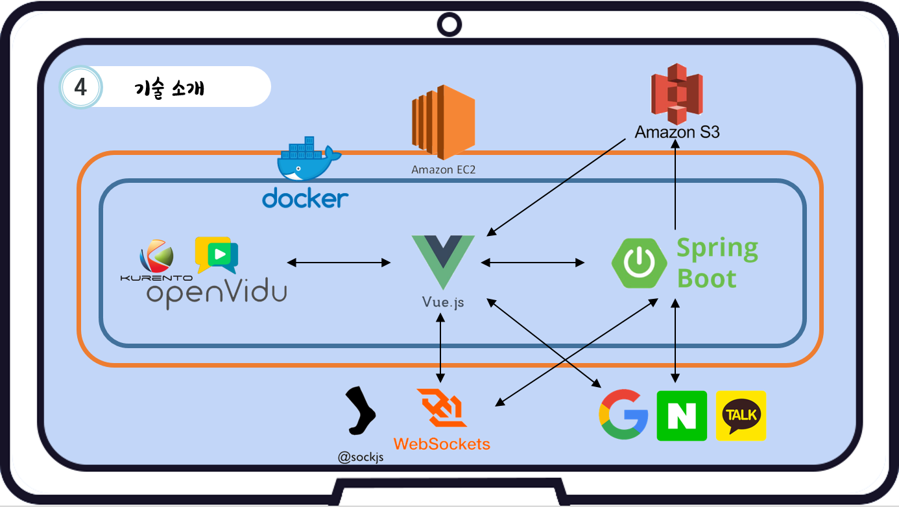

## 기술 스택
- Front-end : Vue3, Vuex, OpenVidu, WebSocket(Sock JS + STOMP)
- Back-end: Spring Boot, JPA, OAuth(2.0), WebSocket(Sock JS + STOMP)
- Database : MySQL, AWS S3
- Infra : AWS EC2, Docker, Jenkins

</br></br>

## 기술 특이점
- 소셜 로그인(OAuth2.0)을 활용한 구글, 네이버, 카카오 로그인 기능 구현
- WebSocket(Sock JS + STOMP)을 이용한 채팅 기능 구현
- OpenVidu를 활용한 화상 채팅 기능 구현
- AWS S3을 이용한 프로필 이미지 저장 및 불러오기

</br></br>

## 구현 기술 내용
- Amazon EC2 위에 Docker가 동작합니다.
- Docker 안에는 Vue, SpringBoot, WebRTC 기술 관련 프레임워크 컨테이너 이미지 들이 올라가 구동됩니다.
- Vue가 클라이언트 사이드에서 중추가 되어 늘비상담 서비스의 다른 서버들과 통신을 합니다.
- OpenVidu는 Kurento를 Base로 한 프레임워크이며, Vue와 Web RTC API 통신을 구현합니다.
- Spring Boot와 Rest API 통신을 하며 SPA(Single Page Application)를 구현합니다.
- 채팅 시스템을 구현하기 위한 WebSocket 프로토콜, Sock JS를 사용하고 있고, 소셜 로그인을 위해 구글, 네이버, 카카오 외부 서버와 통신합니다.
- Amazon S3는 프로필 이미지를 저장 및 불러오게 하기 위해 사용했습니다.


<br/><br/><br/>

# **서비스 소개**

<br/>

## 시작 화면


## 늘비상담의 주요 서비스
  ### 1. 고해성사
- **`“당신의 마음에 따스한 공감을 드려요.”`**
    - 누구나 부담없이 말하기 힘든 속마음을 자신만의 캐릭터를 통해 익명으로 털어놓는 서비스!
    - 나의 고민은 너의 고민, 너의 고민은 나의 고민! 마음으로 소통해요~💌
    - 고립감과 우울증 해소를 위한 자유로운 Talk Talk 서비스!
    - 사용자들은 사연에 공감하며 다양한 반응들을 통해 공감을 표현할 수 있는 서비스!

<br/>

  ### 2. 고민상담!
  - **`“말은 마음을 담는다. 그래서 말에도 체온이 있다.”`**
    - 취업, 연애, 진학 등 힘든 고민에 대한 해결책을 얻을 수 있는 심리상담 서비스!
    - 우리 모두 상담가가 되어 도움을 건낼 수 있는 서비스!
    - 대면 상담은 부담스러운 사람들 위한 비대면 상담 서비스!

<br/><br/><br/>

## 회원가입

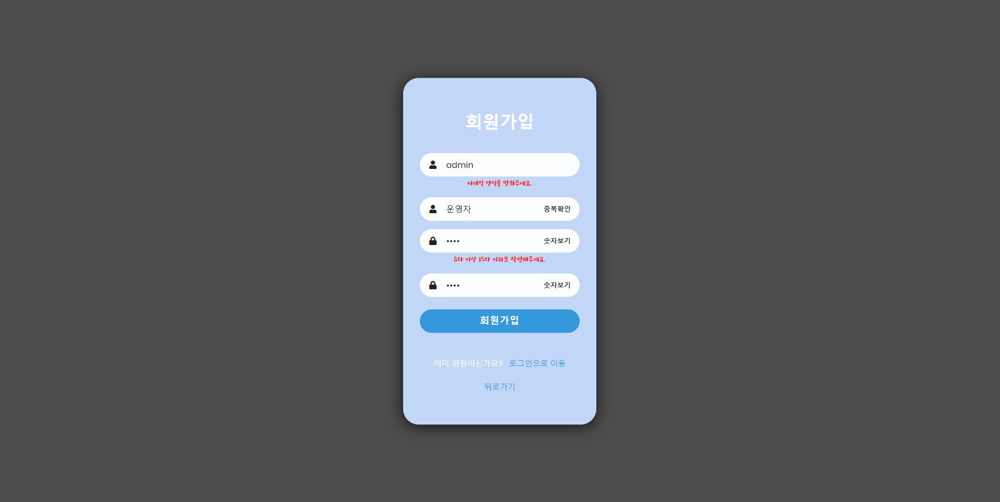

  ### 유효성 검사
  - 회원가입시 이메일, 닉네임, 비밀번호, 비밀번호 확인을 입력받으며 **유효성 검사**를 통해 데이터의 무결성을 유지합니다.
    -  이메일: 이메일 형식을 갖춰야 한다.
    -  닉네임: 중복 검사를 통해 유일한 닉네임만 가능하도록 한다.
    -  비밀번호: 영문, 숫자, 특수문자를 하나 이상 포함하도록 한다.
    -  비밀번호 확인: 비밀번호와 동일한 값임을 확인한다.

<br/><br/><br/>

## 로그인

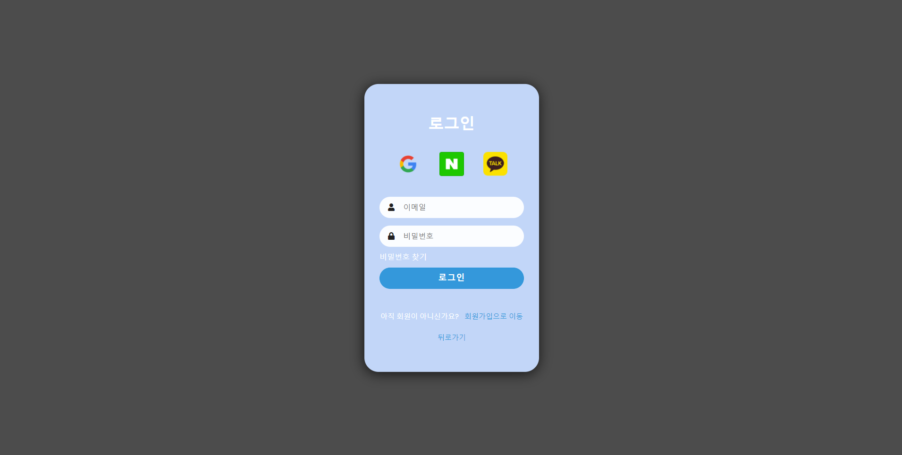
### 1. 로그인
- 회원 가입한 아이디와 비밀번호로 로그인을 할 수 있습니다.
- 비밀번호를 잊어버렸다면, 이메일을 입력하고, 비밀번호 찾기를 누릅니다.
- 그러면 해당 이메일로 임시비밀번호를 전송받게 되고 임시 비밀번호를 통해 로그인을 할 수 있습니다.

<br/>

### 2. 소셜 로그인
- 이미 보유하고 있는 계정을 통해 서비스 가입이 가능한 **소셜 로그인** 기능을 통해 사용자의 **편리성**을 극대화합니다.
- 구글, 네이버, 카카오 자신이 가입되어 있는 원하는 계정으로 쉽게 로그인이 가능합니다.

<br/><br/><br/>

# 프로필

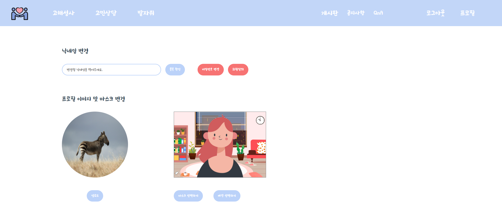
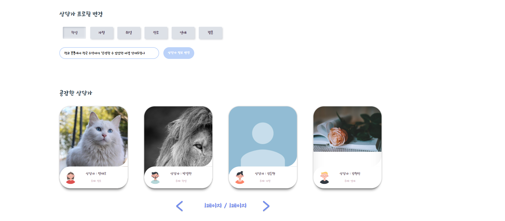
 - 사용자는 프로필 페이지에서 서비스에 사용되는 자신의 정보를 변경할 수 있습니다.
 - 닉네임, 비밀번호 변경, 회원 탈퇴와 같은 회원 정보에 대해 변경할 수 있습니다.
 - 프로필 이미지, 마스크, 배경과 같이 서비스 이용에 필요한 정보들에 대해 변경할 수 있습니다.
 - 상담가 서비스에 필요한 정보를 등록 및 변경할 수 있습니다.

<br><br>

## 개인 프로필

- 닉네임, 프로필 이미지 및 캐릭터 정보를 조회 및 변경이 가능합니다.
- 비밀번호 확인을 통해 사용자 본인임이 확인된 경우 비밀번호 변경과 회원탈퇴가 가능합니다.

<br><br>

## 프로필이미지
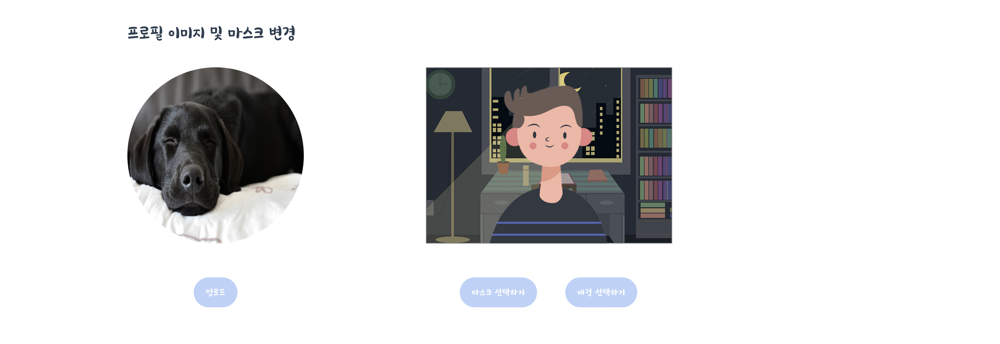
- 자유롭게 프로필 이미지를 커스텀하여 서비스 이용 시 자신의 개성을 드러낼 수 있습니다.

<br><br>

## 캐릭터
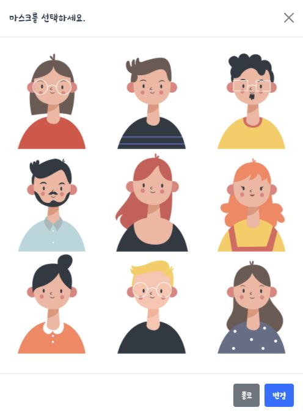
- 사용자는 자신이 원하는 캐릭터와 배경화면을 고를 수 있습니다.
- 9가지의 캐릭터 중에서 자신이 마음에 드는 캐릭터를 선택하면 됩니다.

<br><br>

## 배경
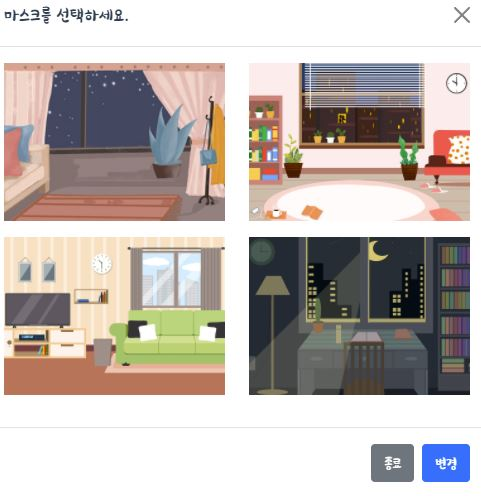
- 이후 사용자의 취향에 따라 4가지의 배경 중 선택할 수 있습니다.
- 적용된 캐릭터와 배경은 서비스 이용 중 언제든 변경이 가능합니다.

<br><br>

## 상담가 프로필
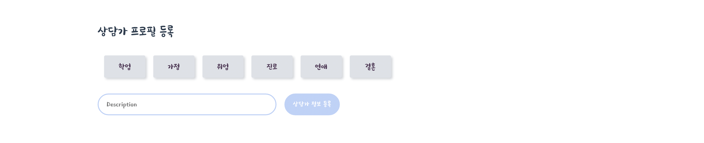
- 사용자는 6가지 주제와 간단한 한 줄 소개를 통해 손쉽게 상담가 등록이 가능합니다.
- 작성한 주제, 한 줄 소개는 언제든 조회 및 변경이 가능합니다.

<br><br>

## 공감한 상담가
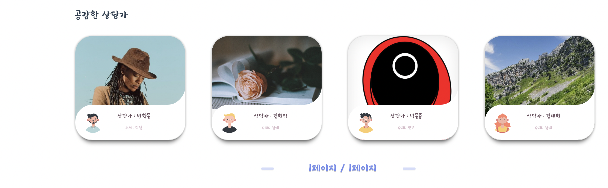
- 고민상담을 통해 만난 상담가를 **공감💗**할 수 있으며, 공감한 상담가 내역을 빠르게 찾아볼 수 있습니다.

<br/><br/><br/>


# 고해성사

 <br>

## 고해성사 메인 페이지
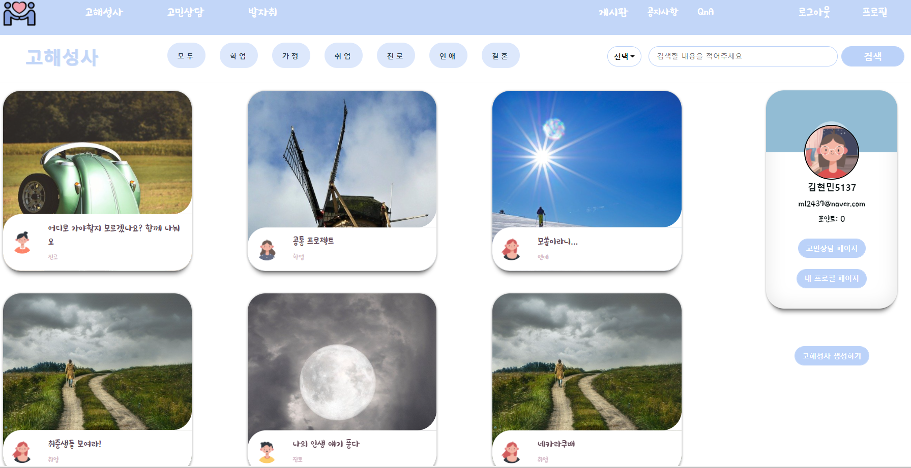
-   늘비상담은 서로를 알지 못하는 사용자들끼리 편하게 마음을 털어놓을 수 있는 고해성사 서비스를 제공합니다.

<br>


- 다양한 주제들 중 원하는 주제를 선택하여 주제에 해당하는 방만 볼 수 있습니다.
- 닉네임, 방제목, 방설명으로 검색하여 방을 찾을 수도 있습니다.


<br>


## 방 생성하기
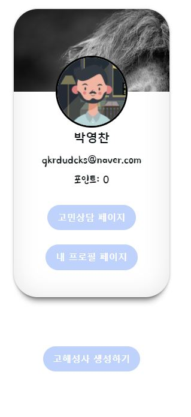

- 만약 원하는 방이 없다면 자신이 직접 방을 만들 수 있습니다.

- 우측 프로필 밑의 생성하기 버튼을 클릭하여 방을 생성할 수 있습니다.


<br/><br/>

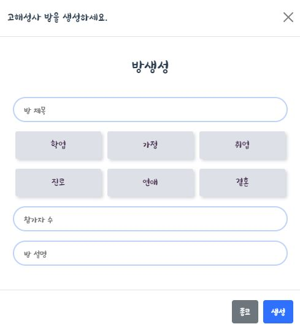

- 고해성사 생성하기 버튼을 누르면 방 설정 창이 뜹니다.
- 제목, 주제, 참가자 수, 방 설명을 정할 수 있습니다.
- 참가자 수는 최대 6명까지 가능합니다.


<br><br>

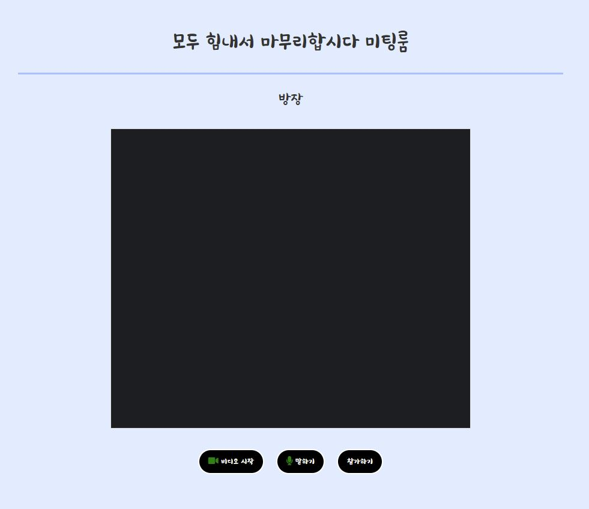

- 방 생성이 완료되면 카메라와 마이크 상태를 점검할 수 있는 준비 페이지로 넘어갑니다.
- 참가하기 버튼을 누르면 방에 참가하게 됩니다.

<br><br>

## 화상채팅

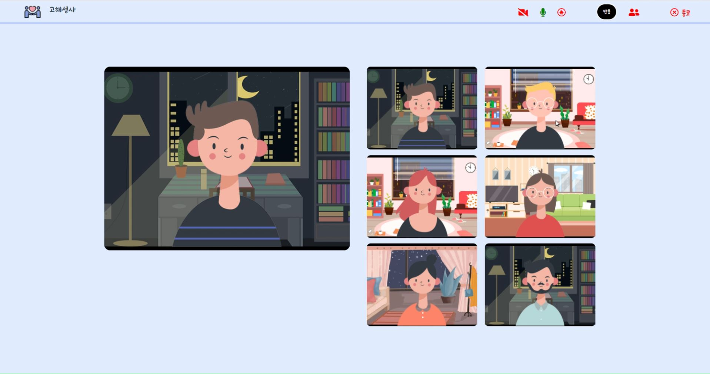
  - 고해성사 서비스는 캐릭터를 이용해 자신의 얼굴을 가리고 익명성을 유지하며 대화를 나눕니다.

<br>

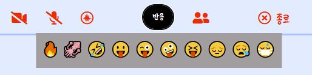

  - 반응을 누르면 이모지를 이용해 다른 사람의 말에 호응을 해줄 수 있습니다.

<br>


  - 종료를 누르면 화상채팅이 종료되고 악성 사용자를 신고할 수 있습니다.

<br>

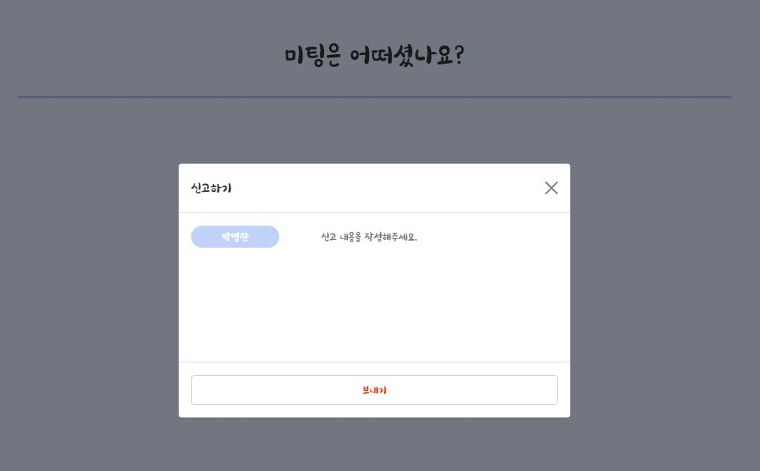
- 악성 사용자의 닉네임을 선택해 신고 내용을 입력하고 보내기를 클릭하면 신고가 완료됩니다.

- 홈으로를 클릭하면 고해성사 페이지로 돌아갑니다.

<br/><br/><br/>


# 고민상담
 | 늘비상담은 자신의 고민을 1대1로 나누고 고민에 대한 답을 구하는 고민상담 서비스를 제공합니다. 
 <br>

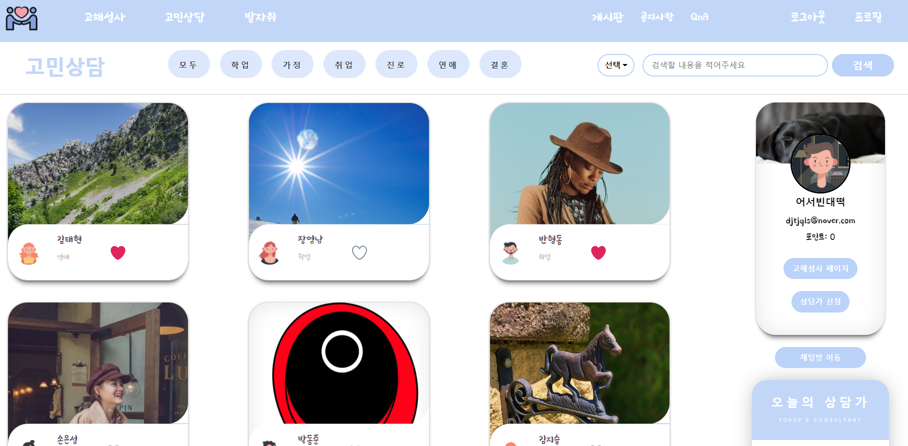

<br><br>

## 상담가 프로필 조회하기
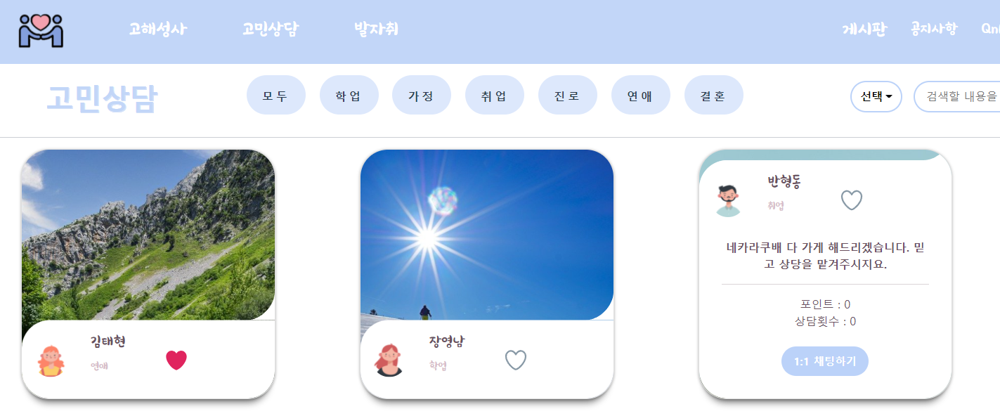
 - 고민상담 페이지에서는 상담가로 신청한 늘비 유저들의 프로필 조회가 가능합니다.

<br><br>

## 선호하는 상담가 추가하기.
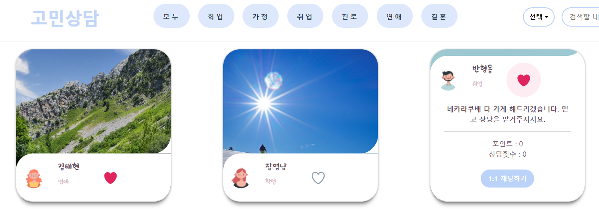
- 상담가 프로필의 **공감💗** 버튼을 이용해 선호하는 상담가 목록을 구성할 수 있습니다.

<br><br>

## 1대1 대화신청
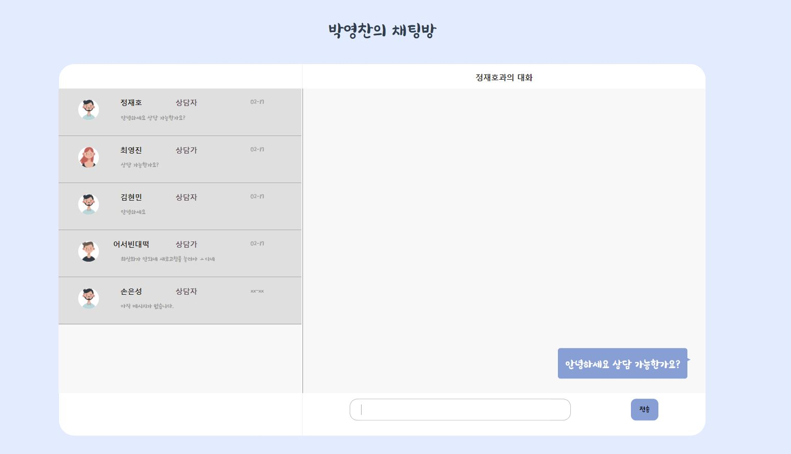
 - 상담가 프로필의 **1:1 채팅하기** 버튼을 통해 대화신청이 가능합니다.
 - 채팅방에서 상담을 진행하기 전 간단한 질문 또는 대화가 가능합니다.
 - 상담가가 마음에 든다면 상담을 요청할 수 있고 상담가는 화상채팅방을 만들 수 있습니다. 

<br><br>

## 화상 채팅방 생성
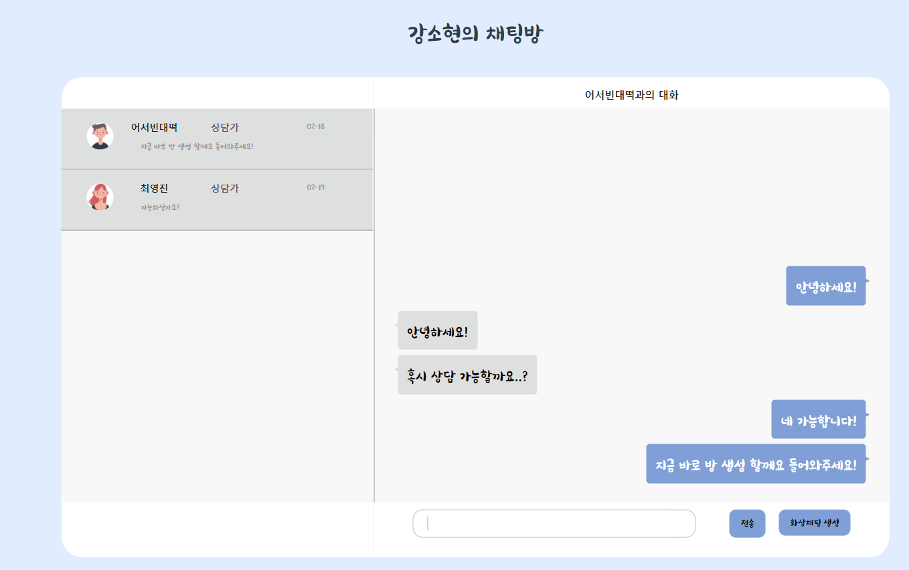
 - 1:1 채팅방에서 상담가는 화상채팅 생성버튼을 통해 화상채팅방 생성 가능합니다.

<br><br>

 ## 화상 채팅방 입장
 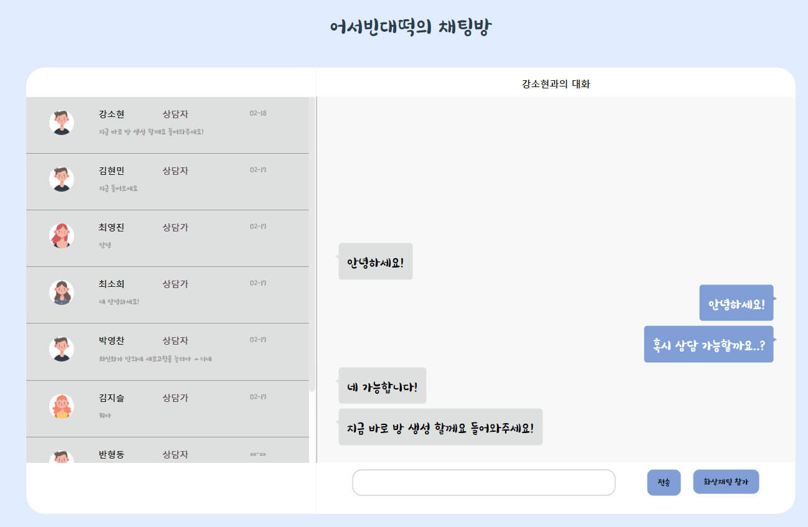
 - 1:1 채팅방에서 상담자는 화상채팅참가 버튼을 통해 화상채팅방 입장 가능합니다.

<br><br>

## 고민상담 화상채팅

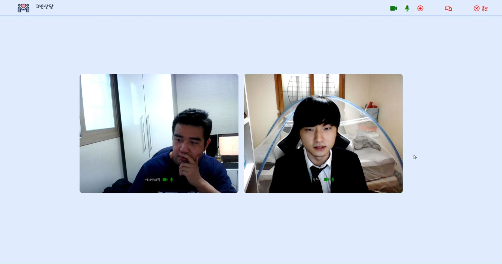
 - 고민상담은 1대1의 상담을 통해 고민거리를 털어놓고 조언과 해결책을 들을 수 있습니다.
 - 자신의 고민 분야에 대해서 여러 사람들에게 인증 받은 상담가의 조언을 얻을 수 있습니다.
 - 우측 상단의 버튼을 통해 카메라,마이크 ON/OFF 설정할 수 있습니다.
 - 우측 상단의 메시지 버튼을 이용해 채팅으로 소통 할 수 있습니다.
 - 우측 상단의 종료 버튼을 이용해 화상채팅을 종료 할 수 있습니다.

<br><br>

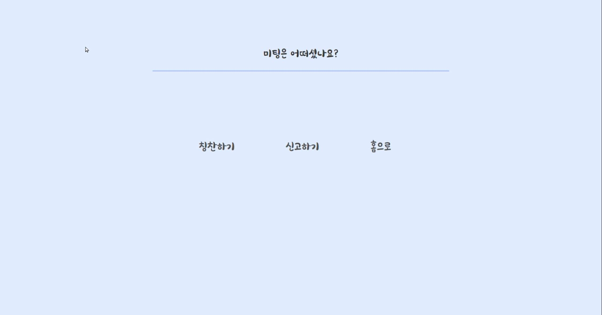

- 고민상담이 종료 된 이후에는 칭찬하기와 신고하기를 통해서 상담가를 평가할 수 있습니다.

<br/><br/>

## 칭찬하기
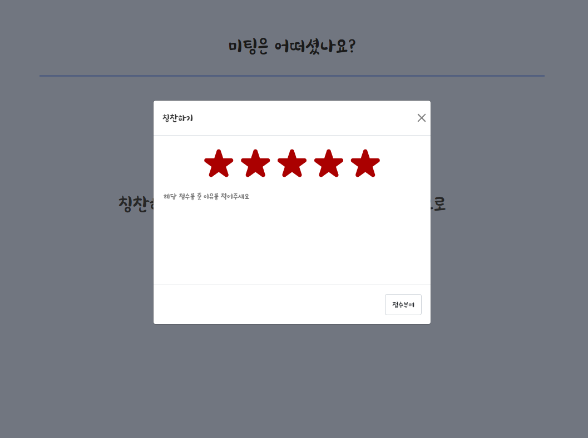
- 상담자는 고민상담이 종료된 후 상담가에 대한 리뷰로 점수와 사유를 작성할 수 있습니다.
- 상담가는 칭찬하기에서 받은 점수로 랭킹을 순위를 달성하게 됩니다.

<br/>

## 신고하기
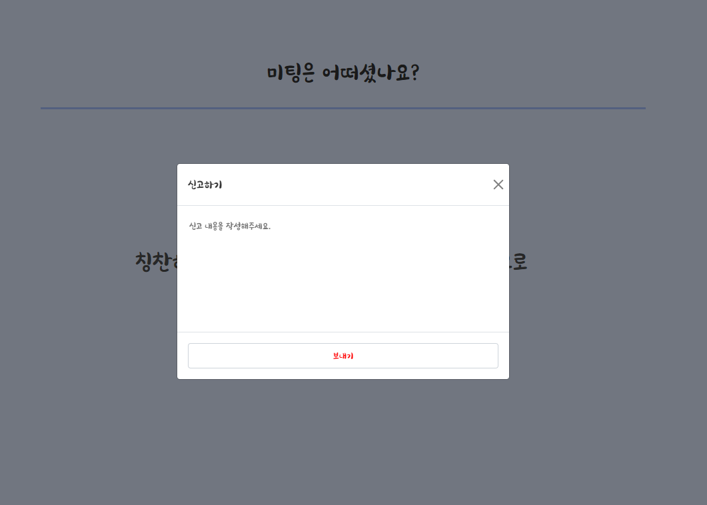
- 상담자는 고민상담이 종료된 후 상담간의 상담자와의 문제사항에 대해 신고 가능합니다.
- 다수의 신고를 받은 상담가는 서비스 이용에 대한 제재 조치가 이루어집니다.


<br/><br/><br/>

# 발자취

### 늘비상담은 사용자의 편의를 위해 발자취👣를 남겨둡니다.

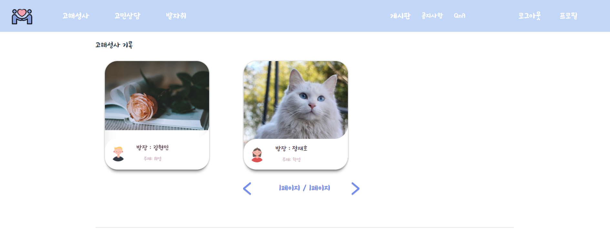

### 1. 고해성사 기록

- 참여한 고해성사 내역을 조회할 수 있습니다.
- 고해성사 방을 생성한 방장, 주제, 한줄 소개, 총 참가자수 그리고 서비스를 이용한 기간을 확인할 수 있습니다.
- 페이지네이션을 통해 가독성을 높였고, 한 페이지당 3개의 고해성사 기록을 확인할 수 있습니다.
- 사용자가 아직 활동한 고해성사 내역이 없을 경우 "아직 고해성사 이력이 없습니다"라는 문구를 출력합니다.

<br/><br/>

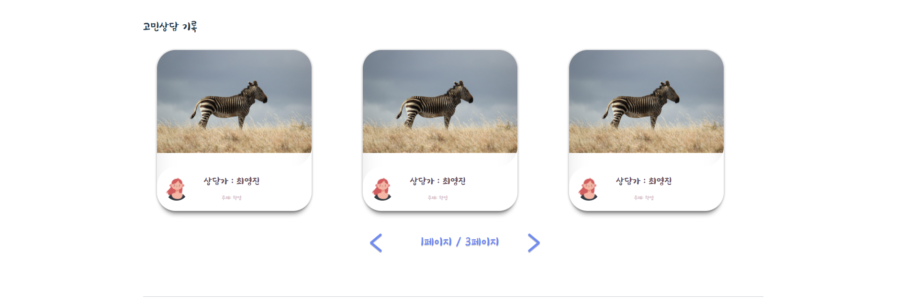

### 2. 고민상담 기록

- 참여한 고민상담 내역을 조회할 수 있습니다.
- 상담가 정보와 주제 그리고 서비스를 이용한 기간을 확인할 수 있습니다.
- 페이지네이션을 통해 가독성을 높였고, 한 페이지당 3개의 고민상담 기록을 확인할 수 있습니다.
- 사용자가 아직 활동한 고민상담 내역이 없을 경우 "아직 고민상담 이력이 없습니다"라는 문구를 출력합니다.

<br/><br/>

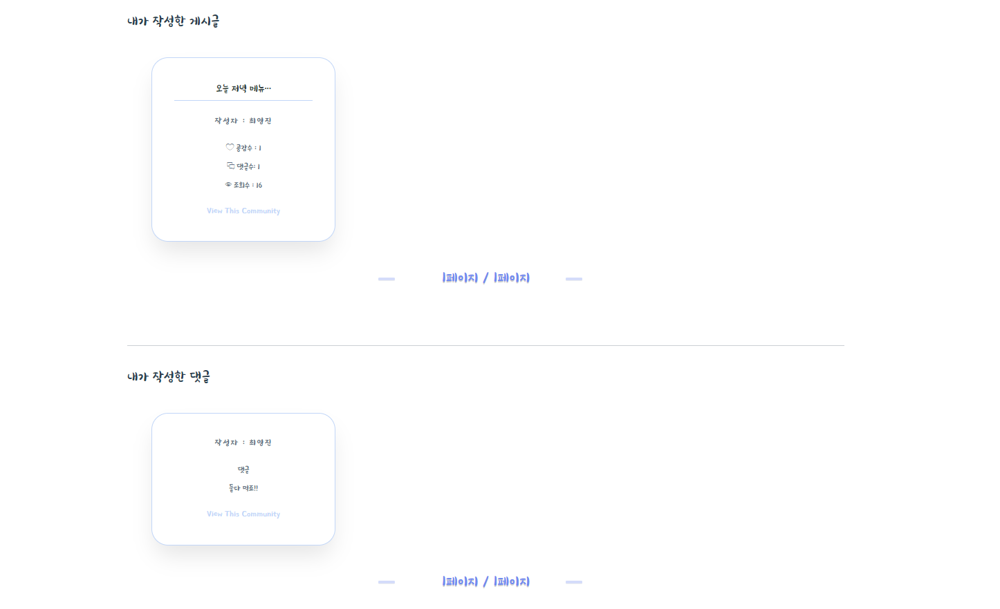

### 3. 게시판 활동

- 작성한 게시글과 댓글을 조회할 수 있습니다.
- 작성한 게시글의 경우 공감수, 댓글수, 조회수를 확인 가능합니다.
- 원하는 게시글이나 댓글의 "**View This Community**"를 클릭시 작성한 게시글 페이지로 이동합니다.
- 페이지네이션을 통해 가독성을 높였고, 게시글과 댓글 모두 한 페이지당 3개의 기록을 확인할 수 있습니다.
- 사용자가 아직 활동한 게시글이나 댓글 내역이 없을 경우 "아직 작성한 게시글or댓글이 없습니다"라는 문구를 출력합니다.

<br/><br/>

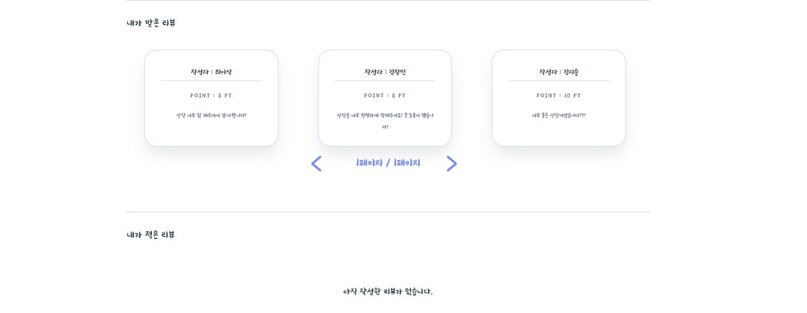

### 4. 리뷰 활동

#### 늘비상담의 고민상담 서비스 이용 직후 **칭찬하기**을 통해 포인트와 한줄평을 작성할 수 있습니다.

- 내가 받은 리뷰
  - 사용자가 상담가로서 활동했을 때 상담자로부터 받은 리뷰 정보입니다.
  - 상담자의 닉네임, 10점 만점의 포인트 정보, 한줄평을 확인할 수 있습니다.
  - 페이지네이션을 통해 가독성을 높였고, 한 페이지당 3개의 내가 받은 리뷰를 확인할 수 있습니다.
  - 사용자가 아직 리뷰를 받지 못했을 경우 "아직 받은 리뷰가 없습니다"라는 문구를 출력합니다.
- 내가 적은 리뷰
  - 사용자가 상담자로서 활동했을 때 상담가에게 작성한 리뷰 정보입니다.
  - 상담가의 닉네임, 10점 만점의 포인트 정보, 한줄평을 확인할 수 있습니다.
  - 고민상담 서비스 직후 직접 작성한 포인트 정보와 한줄평을 바탕으로 상담가 선택에 도움을 줄 수 있습니다.
  - 페이지네이션을 통해 가독성을 높였고, 한 페이지당 3개의 내가 적은 리뷰를 확인할 수 있습니다.
  - 사용자가 아직 리뷰를 작성하지 않을 경우 "아직 작성한 리뷰가 없습니다"라는 문구를 출력합니다.


<br/><br/><br/>

# 게시판

## 게시판 메인화면
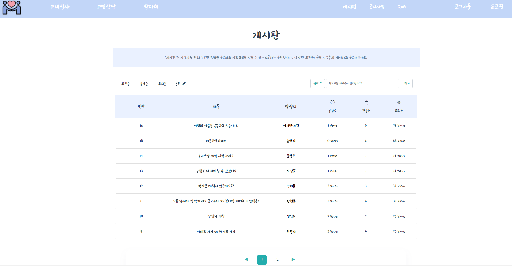

### 게시글 보기
- 우측 상단의 게시판을 눌러 게시판으로 들어올 수 있습니다.
- 게시판 화면으로 들어오면 게시글 목록이 보이고 게시글 중 보고 싶은 게시글을 클릭합니다.
- 해당 게시글의 상세 내용을 볼 수 있는 페이지로 이동할 수 있습니다.

### 페이지네이션
- 한페이지마다 8개의 게시글들이 보이게 되어있습니다.
- 다른 글들을 보기 위해서는 하단의 숫자 버튼을 클릭하여 다음 페이지로 넘어 갈 수 있습니다.

<br/><br/>

## 게시판 상단 메뉴
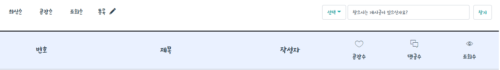

### 검색
- 게시글 목록 우측 상단에 게시글을 검색할 수 있는 창이 존재합니다.
- 선택을 눌러 내용, 제목, 닉네임으로 검색이 가능합니다.
- 검색하고 싶은 키워드를 입력하고 찾기를 누르면 해당하는 게시글 목록을 다시 불러옵니다.

<br/>

### 정렬

- 게시글 목록 좌측 상단을 보면 원하는 순서대로 정렬 할 수 있는 목록이 존재합니다.
- 기본적으로는 게시글 목록으로 들어오게 되면 최신순 정렬이 되며 원한다면 공감을 많이 받은 게시글, 또는 조회순으로 게시글을 정렬해서 보는 것도 가능합니다.
- 아래와 같이 조회순을 누르게 되면 조회수가 가장 높은 글이 제일 앞으로 오는 것을 확인할 수 있습니다.

<br/>

### 공감수 / 댓글수 / 조회수
- 게시글 목록 우측 상단에는 해당 게시글에 공감한 횟수, 달린 댓글 수, 조회수를 확인할 수 있습니다.

<br/><br/>

## 게시글 상세보기
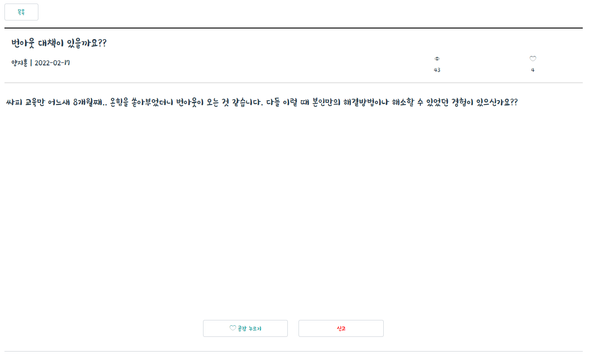


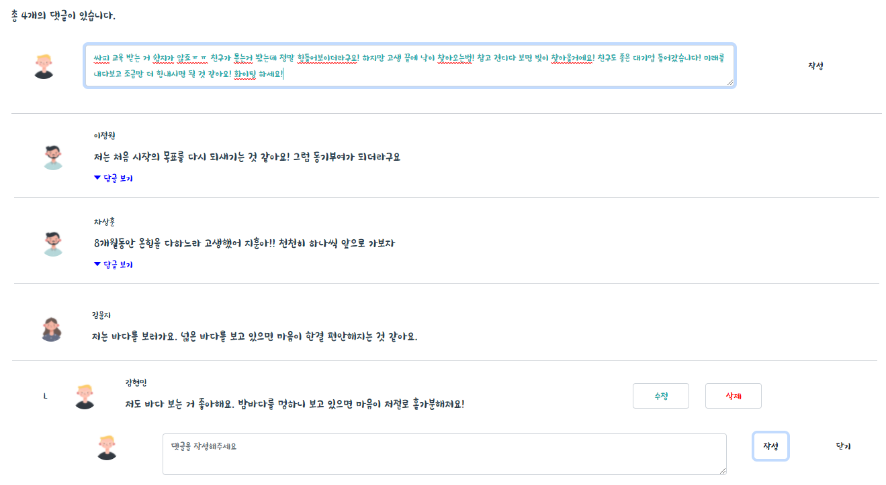

### 상세글
- 게시글 중 보고 싶은 게시글을 클릭하여 들어오면 위와 같은 페이지로 나타납니다.
- 게시글의 제목, 작성자, 작성날짜, 조회수, 공감수, 게시글 내용 등 상세한 내용이 나오게 됩니다.
- 그리고 아래에 공감할 수 있는 버튼이 존재하며, 게시글에 문제가 있다고 판단될 시 신고도 가능합니다.

### 댓글
- 게시글을 아래쪽에는 해당 게시글에 사용자들이 남긴 댓글들이 존재하며, 자신도 댓글을 달 수 있습니다.
- 위 그림처럼 게시글에 대한 댓글을 작성하고 우측의 작성 버튼을 누르게 되면 댓글이 달리게 됩니다.
  

<br/>

### 대댓글
- 대댓글, 즉 댓글의 댓글을 보고 싶을 경우 댓글 보기를 클릭하면 대댓글을 볼 수 있습니다.
- 또한, 대댓글을 남길 수 있는 창도 나타나게 됩니다.
- 댓글 작성법과 마찬가지로 내용을 작성하고 작성 버턴을 누르게 되면 대댓글이 실시간으로 달리게 됩니다.
- 작성 옆의 닫기 버튼을 누르게 되면 대댓글 창이 닫히게 됩니다.

<br/><br/><br/>

# 공지사항

## 공지사항 메인화면
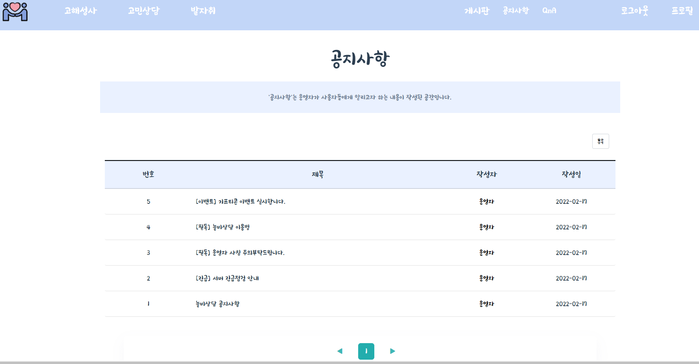
- 상단의 메뉴에서 공지사항 버튼을 누르게 되면 공지사항 메인화면으로 들어올 수 있습니다.
- 이 곳은 늘비상담 사이트 이용 수칙, 공지사항, 이벤트들을 확인할 수 있는 공간입니다.
- 사용자들은 공지사항을 확인만 할 수 있으며, 공지사항을 작성할 수 없습니다.
- 사이트 운영자만 공지사항을 작성 할 수 있습니다.

<br/><br/>


## 공지사항 상세보기
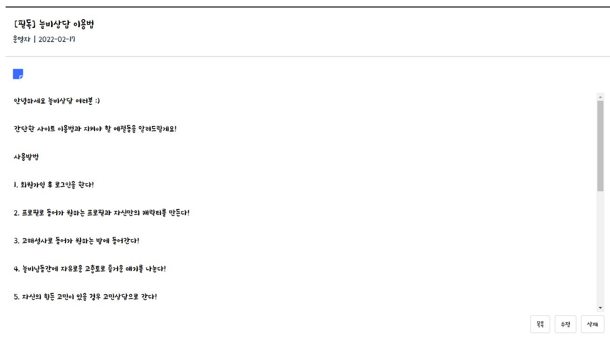
- 공지사항 중 보고 싶은 공지사항을 클릭하여 들어오면 위와 같은 페이지로 나타납니다.
- 공지사항 목록으로 돌아가려면 우측 하단의 목록 버튼을 누르면 목록으로 돌아갈 수 있습니다.
- 사이트 운영자만 공지사항 수정, 삭제를 할 수 있습니다.

<br/><br/><br/>

# Q&A

## Q&A 메인화면
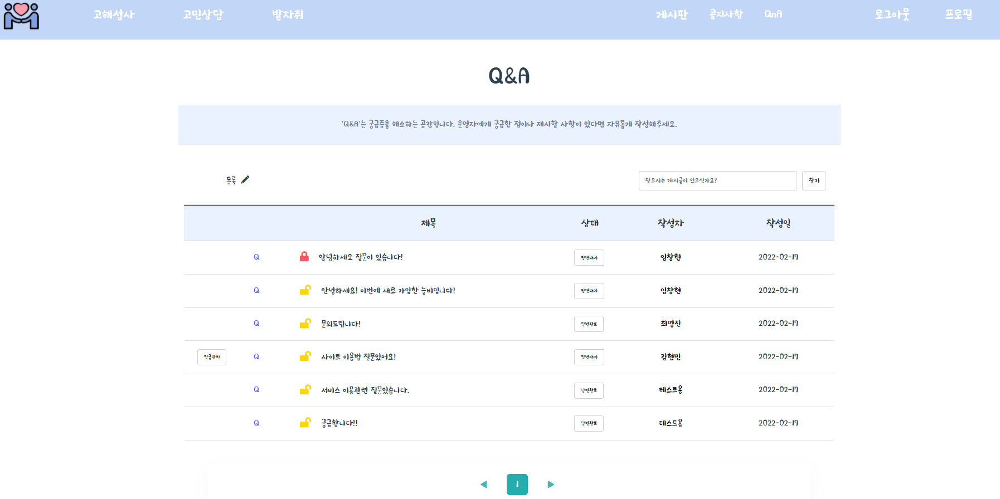
- 상단의 메뉴에서 Q&A 버튼을 누르게 되면 Q&A 메인화면으로 들어올 수 있습니다.
- 이 곳은 늘비상담 사이트 이용하며 궁금한 사항들을 운영자에게 질문을 남길 수 있는 공간입니다.
- 사용자들은 자유롭게 Q&A를 남겨 원하는 질문을 할 수 있고 답변을 받을 수 있습니다.

<br/><br/>

## Q&A 작성
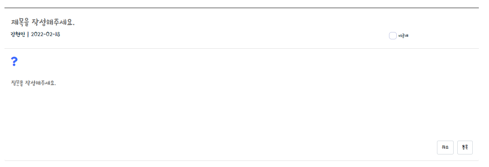
- Q&A 작성시 공개 / 비공개를 선택하여 질문을 다른 사람들에게 비공개를 할 수 있습니다.
- 제목과 게시글을 작성한 뒤 등록을 누르게 되면 Q&A를 남길 수 있습니다.

<br/><br/>

## Q&A 답글
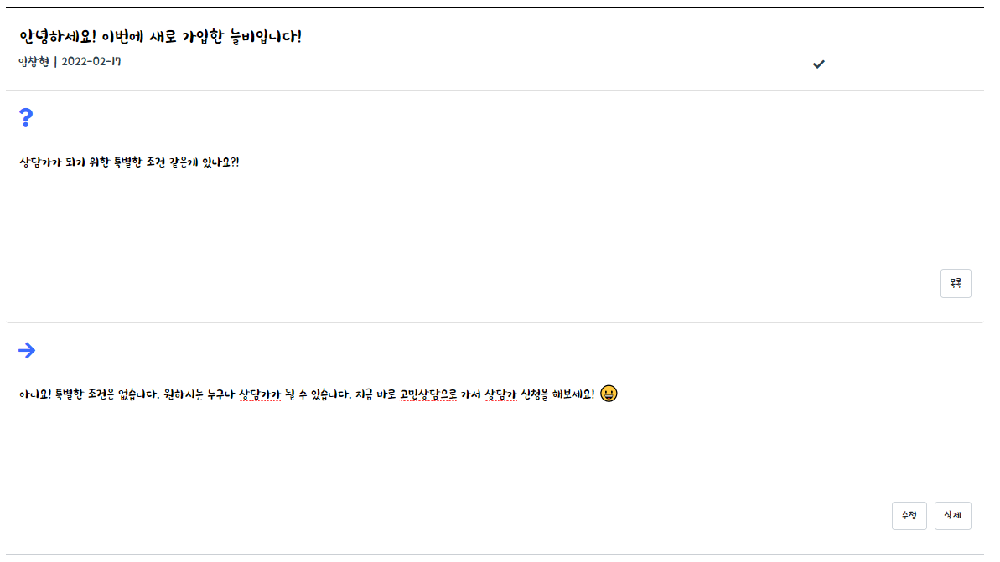
- 답변 작성은 운영자만 가능하며, 화면과 같이 답글 관리라는 버튼이 나오게 됩니다.
- 자신이 작성자라면 마찬가지로 답글 관리를 할 수 있습니다.

<br/><br/>

## Q&A 상세보기
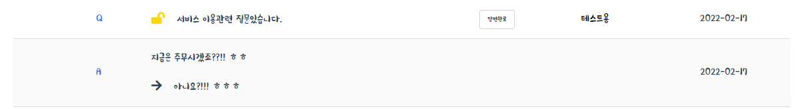
- 자신이 작성자이거나 공개된 Q&A라면 잠금 해제 아이콘이 표시됩니다.
- 답글이 작성이 된 Q&A라면 클릭하여 답글을 확인해 볼 수 있습니다.

<br/><br/><br/>

# 빌드 및 배포에 필요한 정보
<br>

# 1. 주요 버전
1. JVM : 1.8.0.312
2. Web Server : Nginx 1.18.0
3. WAS : Tomcat 9.0.45
4. Visual Studio : 1.64.2
5. IntelliJ : IntelliJ IDEA 2021.3.2 (community)
6. Vue : 3.0.0
7. NodeJS : v16.13.1
8. springBootVer = '2.4.5'
9. 상세 버전 정보
   - FrontEnd : pakage.json
   - SpringBoot : build.gradle

<br/><br/>

# 2. 환경 변수

## 1. front-end/Dockerfile

```bash
FROM node:16 as build-stage
WORKDIR /app
ADD . .
RUN npm install
RUN npm run build

FROM nginx:stable-alpine as production-stage
COPY  ./nginx.conf /etc/nginx/conf.d/default.conf

COPY --from=build-stage /app/dist /usr/share/nginx/html
CMD ["nginx", "-g", "daemon off;"]

```

<br>

## 2. nginx.conf

```bash
# frontend/nginx/nginx.conf

server {
  listen 9999;
  listen [::]:9999;
	
	# server_name 도메인;
  server_name {server_name};

  access_log /var/log/nginx/access.log;
	error_log /var/log/nginx/error.log;

  location / {
    alias /usr/share/nginx/html;
    try_files $uri $uri/ /index.html;
    return 301 https://$server_name$request_uri; # http 접속 시 https 로 자동 접속
  }
}

server {
	listen 443 ssl;
	listen [::]:443 ssl;
	 
	# server_name 도메인;
	server_name {server_name};

	ssl_certificate /var/www/html/fullchain.pem;
	ssl_certificate_key /var/www/html/privkey.pem;

	root /usr/share/nginx/html;
	index index.html;

	location / {
		try_files $uri $uri/ /index.html;
	}
}
```

<br>

## 3. OpenVidu
```bash
# OpenVidu configuration
# ----------------------
# Documentation: https://docs.openvidu.io/en/stable/reference-docs/openvidu-config/

# NOTE: This file doesn't need to quote assignment values, like most shells do.
# All values are stored as-is, even if they contain spaces, so don't quote them.

# Domain name. If you do not have one, the public IP of the machine.
# For example: 198.51.100.1, or openvidu.example.com
DOMAIN_OR_PUBLIC_IP=localhost

# OpenVidu SECRET used for apps to connect to OpenVidu server and users to access to OpenVidu Dashboard
OPENVIDU_SECRET=MY_SECRET

# Certificate type:
# - selfsigned:  Self signed certificate. Not recommended for production use.
#                Users will see an ERROR when connected to web page.
# - owncert:     Valid certificate purchased in a Internet services company.
#                Please put the certificates files inside folder ./owncert
#                with names certificate.key and certificate.cert
# - letsencrypt: Generate a new certificate using letsencrypt. Please set the
#                required contact email for Let's Encrypt in LETSENCRYPT_EMAIL
#                variable.
CERTIFICATE_TYPE=letsencrypt

# If CERTIFICATE_TYPE=letsencrypt, you need to configure a valid email for notifications
LETSENCRYPT_EMAIL={email}

# Proxy configuration
# If you want to change the ports on which openvidu listens, uncomment the following lines

# Allows any request to http://DOMAIN_OR_PUBLIC_IP:HTTP_PORT/ to be automatically
# redirected to https://DOMAIN_OR_PUBLIC_IP:HTTPS_PORT/.
# WARNING: the default port 80 cannot be changed during the first boot
# if you have chosen to deploy with the option CERTIFICATE_TYPE=letsencrypt
HTTP_PORT=80

# Changes the port of all services exposed by OpenVidu.
# SDKs, REST clients and browsers will have to connect to this port
HTTPS_PORT=9000
```

<br>

## 4. Spring application.properties
```properties
# application-prod.properties
# SSL ??

server.port=8080
server.ssl.enabled=true
server.ssl.key-store-type=PKCS12
server.ssl.key-store=/root/key.p12
server.ssl.key-store-password="비밀번호"


#it will be set build date by gradle. if this value is @build.date@, front-end is development mode
build.date=@build.date@
server.servlet.contextPath=/
# Charset of HTTP requests and responses. Added to the "Content-Type" header if not set explicitly.
server.servlet.encoding.charset=UTF-8
# Enable http encoding support.
server.servlet.encoding.enabled=true
# Force the encoding to the configured charset on HTTP requests and responses.
server.servlet.encoding.force=true

# for SPA
spring.resources.static-locations=classpath:/dist/
spa.default-file=/dist/index.html
spring.mvc.throw-exception-if-no-handler-found=true
spring.resources.add-mappings=false

# Swagger
springfox.documentation.swagger.use-model-v3=false

#database
spring.jpa.hibernate.naming.implicit-strategy=org.springframework.boot.orm.jpa.hibernate.SpringImplicitNamingStrategy
spring.jpa.hibernate.naming.physical-strategy=org.springframework.boot.orm.jpa.hibernate.SpringPhysicalNamingStrategy
spring.jpa.hibernate.ddl-auto=update
spring.jpa.properties.hibernate.dialect=org.hibernate.dialect.MySQL57Dialect
spring.data.web.pageable.one-indexed-parameters=true
spring.datasource.url="Database URL"
spring.datasource.driver-class-name=com.mysql.cj.jdbc.Driver
spring.datasource.hikari.username="Database ID"
spring.datasource.hikari.password="Database Password"

# jwt
jwt.secret="jwt secret key"
# unit is ms. 15 * 24 * 60 * 60 * 1000 = 15days
jwt.expiration="jwt 만료시간"

#logging
logging.file.name=./ssafy-web.log
logging.level.root=INFO
logging.level.com.samsung.security=DEBUG
logging.level.org.springframework.web=DEBUG
logging.level.org.apache.tiles=INFO
logging.level.org.sringframework.boot=DEBUG
logging.level.org.sringframework.security=DEBUG
spring.jpa.properties.hibernate.show_sql=true

spring.devtools.livereload.enabled=true

#gzip compression
server.compression.enabled=true
server.compression.mime-types=application/json,application/xml,text/html,text/xml,text/plain,application/javascript,text/css

#for health check
management.servlet.context-path=/manage
management.health.db.enabled=true
management.health.default.enabled=true
management.health.diskspace.enabled=true

#Google Email
spring.mail.host=smtp.gmail.com
spring.mail.port=587
spring.mail.username="Email ID"
spring.mail.password="Email password"
spring.mail.properties.mail.smtp.starttls.enable=true
spring.mail.properties.mail.smtp.starttls.required=true
spring.mail.properties.mail.smtp.auth=true

#Social Login
spring.security.oauth2.client.registration.google.client-id="google social client id"
spring.security.oauth2.client.registration.google.client-secret="google social secret key"
spring.security.oauth2.client.registration.google.scope=profile,email
spring.profiles.include=oauth

spring.security.oauth2.client.registration.naver.client-id="Naver Client Id"
spring.security.oauth2.client.registration.naver.client-secret="Naver Client Secret Key"
spring.security.oauth2.client.registration.naver.client-authentication-method=post
spring.security.oauth2.client.registration.naver.authorization-grant-type=authorization_code
spring.security.oauth2.client.registration.naver.redirect-uri={baseUrl}/{action}/oauth2/code/{registrationId}
spring.security.oauth2.client.registration.naver.scope=nickname, email, profile_image
spring.security.oauth2.client.registration.naver.client-name=Naver

spring.security.oauth2.client.provider.naver.authorization-uri=https://nid.naver.com/oauth2.0/authorize
spring.security.oauth2.client.provider.naver.token-uri=https://nid.naver.com/oauth2.0/token
spring.security.oauth2.client.provider.naver.user-info-uri=https://openapi.naver.com/v1/nid/me
spring.security.oauth2.client.provider.naver.user-name-attribute=response

spring.security.oauth2.client.registration.kakao.client-id="Kakao client Id"
spring.security.oauth2.client.registration.kakao.client-secret="Kakao Client Secret Key"
spring.security.oauth2.client.registration.kakao.client-authentication-method=post
spring.security.oauth2.client.registration.kakao.authorization-grant-type=authorization_code
spring.security.oauth2.client.registration.kakao.redirect-uri={baseUrl}/{action}/oauth2/code/{registrationId}
spring.security.oauth2.client.registration.kakao.scope=profile_nickname, profile_image, account_email
spring.security.oauth2.client.registration.kakao.client-name=Kakao

spring.security.oauth2.client.provider.kakao.authorization-uri=https://kauth.kakao.com/oauth/authorize
spring.security.oauth2.client.provider.kakao.token-uri=https://kauth.kakao.com/oauth/token
spring.security.oauth2.client.provider.kakao.user-info-uri=https://kapi.kakao.com/v2/user/me
spring.security.oauth2.client.provider.kakao.user-name-attribute=id

# app.oauth2.authorizedRedirectUris=http://localhost:3000/oauth/redirect

spring.servlet.multipart.file-size-threshold=1MB
spring.servlet.multipart.location=C:/Temp
spring.servlet.multipart.max-file-size=30MB
spring.servlet.multipart.max-request-size=30MB


#AWS S3 Cloud key
cloud.aws.credentials.accessKey="AWS S3 accessKey"
cloud.aws.credentials.secretKey="AWS S3 secretKey"
cloud.aws.stack.auto=false

# AWS S3 Service bucket
cloud.aws.s3.bucket="Bucket Name"
cloud.aws.region.static=ap-northeast-2

# AWS S3 Bucket URL
cloud.aws.s3.bucket.url="Bucket url"
```

<br><br><br>

# 3. 배포 시 특이 사항

### 오류 원인: coturn 서버 문제
- OpenVidu 서버 http 포트를 변경해도 적용되지 않고, 80번 포트를 차지함. 

<br/><br/>

### 해결 방법: http 포트 변경을 통한 해결
- 포트 이슈 해결을 위해 기존 프론트엔드가 가지고 있던 http 포트를 변경하여 해결함.

<br/><br/>

### 현재 : 현재 특이사항 없음

<br/><br/><br>

# 4. 주요 계정 및 프로퍼티
## application.properties
- local에서 사용하는 정보들
  - 연동된 database(mysql) 연결 계정 정보
  - Google Email 서비스 계정 정보
  - 소셜로그인 연결 클라이언트 ID, Secret 정보
    - 구글
    - 네이버
    - 카카오
  - AWS S3
    - accessKey
    - secretKey
    - bucket
  

<br/>

## application-prod.properties 
- application.properties 정보를 포함한 ssl 정보 등 BackEnd AWS EC2 배포시 필요한 추가정보들 저장

<br><br><br>

# 5. ERD
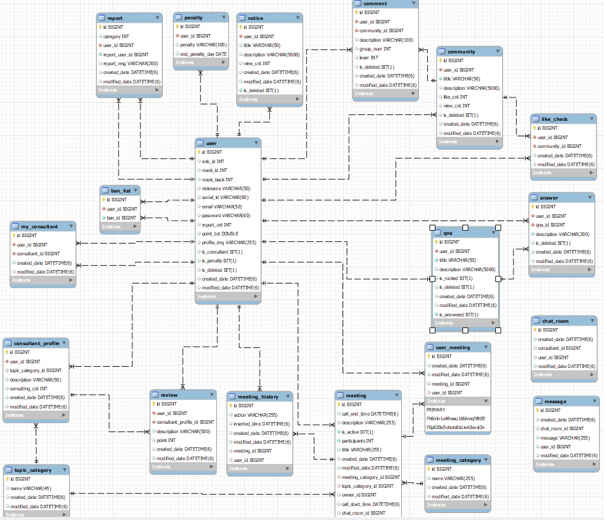

<br><br><br>

# 배포 및 주요 기술 설명

<br>

# 배포 

## EC2 ubuntu 서버를 이용하여 배포
<br/>

---

## Docker 설치
- 애플리케이션을 신속하게 구축, 테스트 및 배포할 수 있는 소프트웨어 플랫폼

<br/>

### 1. 필수 패키지 설치
```bash
sudo apt-get install apt-transport-https ca-certificates curl gnupg-agent software-properties-common
```

<br/>

### 2. GPG Key 인증
```bash
curl -fsSL https://download.docker.com/linux/ubuntu/gpg | sudo apt-key add -
```

<br/>

### 3. docker repository 등록
```bash
sudo add-apt-repository "deb [arch=amd64] https://download.docker.com/linux/ubuntu $(lsb_release -cs) stable"
```

<br/>

### 4. docker 설치
```bash
sudo apt-get update && sudo apt-get install docker-ce docker-ce-cli containerd.io
```

<br>             

## jenkins
- CI/CD 툴
- 지속적 통합 지속적 배포

<br/>

### 1. run 명령어
```bash
  sudo docker run -d --name jenkins -u root --privileged \
  
  -p '9090:8080' \
  
  -v '/home/ubuntu/docker-volume/jenkins:/var/jenkins_home' \
  
  -v '/var/run/docker.sock:/var/run/docker.sock' \
  
  -v '/usr/bin/docker:/usr/bin/docker' \
  
  jenkins/jenkins 
```

<br/>

### 2. Docker 사용 확인
```bash
  sudo docker exec -it jenkins bash
  
  docker -v
```

<br/>

### 3. Jenkins 컨테이너 내부 docker-compose 설치
```bash
  docker exec -it jenkins bash

  curl -L "https://github.com/docker/compose/releases/download/1.27.4/docker-compose-$(uname -s)-$(uname -m)" -o /usr/local/bin/docker-compose
  
  chmod +x /usr/local/bin/docker-compose
  
  docker-compose -v
```

<br/>

### 4. Jenkins 환경 설정
```bash
  {Jenkins url} 접속
  
  sudo docker logs jenkins 명령어 입력 -> root 계정 비밀번호 확인 후 입력
  
  Install suggested plugins 선택
  
  계정 생성
```

<br/><br/>


## SSL 인증서 발급

<br/>

### 1. letsencrypt 설치하기
```bash
  sudo apt-get update 
  sudo apt-get install letsencrypt
```

<br/>

### 2.  인증서 발급 
```bash
  sudo letsencrypt certonly --standalone -d {Jenkins url}
```

<br/>  

### 3. 비밀번호, 이메일 입력 및 안내 사항에 동의 후 진행  

<br/>

### 4. root 계정 로그인 
```bash
  sudo su
```

<br/>

### 5. 인증서 위치 폴더 이동 
```bash
cd /etc/letsencrypt/live/도메인
```
- pem을 PKCS12 형식으로 변경 
```
  openssl pkcs12 -export -in fullchain.pem -inkey privkey.pem -out key.p12 -name airpageserver -CAfile chain.pem -caname root 
```

<br/>

### 6. 인증서 복사 

<br/>

### 7. 인증서 보관 폴더를 미리 생성해 주세요 
 ```bash
  sudo cp [파일이름] [인증서를 보관 할 docker volume 폴더]

  예시) 
  sudo cp fullchain.pem /home/ubuntu/docker-volume/ssl 

  sudo cp privkey.pem /home/ubuntu/docker-volume/ssl  

  sudo cp key.p12 /home/ubuntu/docker-volume/ssl
 ```

<br><br>

## 프론트엔드
- nginx : 배포용 경량 웹서버
- DockerFile 작성
  
```bash
  FROM node:14 as build-stage
  WORKDIR /app
  ADD . .
  RUN npm install
  RUN npm run build

  FROM nginx:stable-alpine as production-stage
  COPY  ./nginx/nginx.conf /etc/nginx/conf.d/default.conf

  COPY --from=build-stage /app/dist /usr/share/nginx/html
  CMD ["nginx", "-g", "daemon off;"]
```


- nginx 설정 파일 작성

```bash
  # 80 port를 openvidu에서 쓰기 때문에 9999 port 사용
  server {
  listen 9999;
  listen [::]:9999;
      
      # server_name 도메인;
  server_name {server_name};

  access_log /var/log/nginx/access.log;
      error_log /var/log/nginx/error.log;

  location / {
      alias /usr/share/nginx/html;
      try_files $uri $uri/ /index.html;
      return 301 https://$server_name$request_uri; # http 접속 시 https 로 자동 접속
  }
  }

  server {
      listen 443 ssl;
      listen [::]:443 ssl;
      
      # server_name 도메인;
      server_name {server_name};

      ssl_certificate /var/www/html/fullchain.pem;
      ssl_certificate_key /var/www/html/privkey.pem;

      root /usr/share/nginx/html;
      index index.html;

      location / {
          try_files $uri $uri/ /index.html;
      }
  }
```

<br/><br/>

## 백엔드

<br/>

### 배포용 application.properties 작성
1. 배포용 설정을 입력하기 위한 application-prod.properties 생성
2. 기존 설정 + SSL 설정 작성
```bash
  # application-prod.properties
  # SSL 설정

  server.port=8080
  server.ssl.enabled=true
  server.ssl.key-store-type=PKCS12
  server.ssl.key-store=/root/key.p12
  server.ssl.key-store-password=#인증서 비밀번호
```

<br/>

### Dockerfile 작성
```
  # backend/Dockerfile
  # 사용한 openjdk 버전에 맞는 값을 입력해주세요.
  FROM openjdk:8-jdk-alpine

  # jar 파일 경로는 직접 입력해주세요.
  COPY build/libs/backend-0.0.1-SNAPSHOT.jar app.jar

  # 배포용 properties 실행 명령어
  ENTRYPOINT ["java","-jar","app.jar","--spring.config.name=application-prod"] 
```

<br><br>


## 통합 docker-compose
```bash
  # 프로젝트 Root 폴더
  version: '3.2'

  services: 
  frontend:
      image: frontend-vue
      build:
      context: frontend/
      dockerfile: Dockerfile
      ports:
      - "9999:9999"
      - "443:443" 
      # [인증서 파일 저장 경로]:/var/www/html
      volumes:
      - /home/ubuntu/docker-volume/ssl:/var/www/html
      container_name: "front-end"
  
  backend:
      image: backend-spring
      build:
      context: backend/
      dockerfile: Dockerfile
      ports:
      - "8443:8443"  
          # [인증서 파일 저장 경로]:/root 
      volumes:
      - /home/ubuntu/docker-volume/ssl:/root
      container_name: "back-end"
```

<br/><br/>


## Jenkins Credential & Webhook & Pipeline

<br/>

### Credential
  1. Username / Password : Gitalb 계정
  2. ID : Credential 식별자
  3. Description : Credential 설명

<br/>

### Webhook
<br/>

1. GitLab 플러그인 설치
      ```
      Jenkins 관리 → 플러그인 관리 → 설치 가능 - GitLab 설치 및 재시작
      ```
      <br/>

2. Pipeline 생성
      ```
      새로운 Item → Pipeline 
      ```
      <br/>        

3. Jenkins - GitLab Webhooks Secret token 생성
      ```
      구성 → Build when a change is pushed to ...→ 고급 버튼→ Secret token 
      ```

<br/>

4. Gitlab - Webhooks 설정
      ```
      Settings - Webhooks → URL : #1 URL→ Secret token : #2 Secret token→ Add webhook → Test - Push Events → Hook executed successfully: HTTP 200확인
      ```

<br/>

5. Push events 에서 Trigger 를 발생시킬 branch로 deploy branch 설정

<br/>

6. Pipeline
      ```
      Definition - Pipeline script
      ```
      

<br/>

7. Script 입력
      ```
      node {
            stage ('clone') {
                git branch: 'deploy', credentialsId: 'credential 식별자', url: 'Gitlab 저장소 Url'
            }
            stage ('gradle build') {
                        // 팀 프로젝트 설정(백엔드 폴더 이름, 사용 배포 도구(Gradle, Maven)에 맞게 수정
                dir('back-end'){
                    sh 'chmod +x gradlew'
                    sh './gradlew build'
                } 
            }
      
            stage ('docker build') {
                sh 'docker-compose down --rmi all' 
                        sh 'docker-compose up -d --build' 
                        sh 'docker rmi $(docker images -f "dangling=true" -q)'
            } 
        }
      ```

<br/><br/><br/>

# OAuth 2.0

## OAuth 2.0란?
- Open Authorization 2.0, OAuth2

- 인증을 위한 개방형 표준 프로토콜

- third-Party 프로그램에게 리소스 소유자를 대신하여 리소스 서버에서 제공하는 자원에 대한 접근 권한을 위임하는 방식을 제공

- 간편 로그인 기능 구현을 위해 사용
    - 구글, 페이스북, 카카오, 네이버 등
    <br/><br/>


## **OAuth 2.0 주요 용어**

| 용어 | 설명 |
| --- | --- |
| Authentication | 인증, 접근 자격이 있는지 검증하는 단계를 말합니다. |
| Authorization | 인가, 자원에 접근할 권한을 부여하는 것입니다. 인가가 완료되면 리소스 접근 권한이 담긴 Access Token이 클라이언트에게 부여됩니다 |
| Access Token | 리소스 서버에게서 리소스 소유자의 보호된 자원을 획득할 때 사용되는 만료 기간이 있는 Token입니다. |
| Refresh Token | Access Token 만료시 이를 갱신하기 위한 용도로 사용하는 Token입니다. Refresh Token은 일반적으로 Access Token보다 만료 기간이 깁니다. |


<br/><br/>

## accessToken
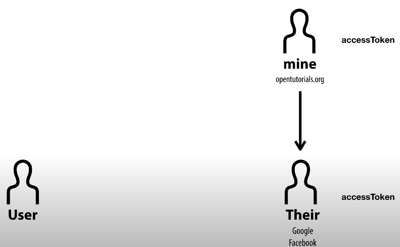
- 아이디 / 비밀번호가 아니라서 안전
- 나의 서비스에서 꼭 필요한 기능 일부분만 이용할 수 있는 장점

<br/><br/>    

## 역할 구분
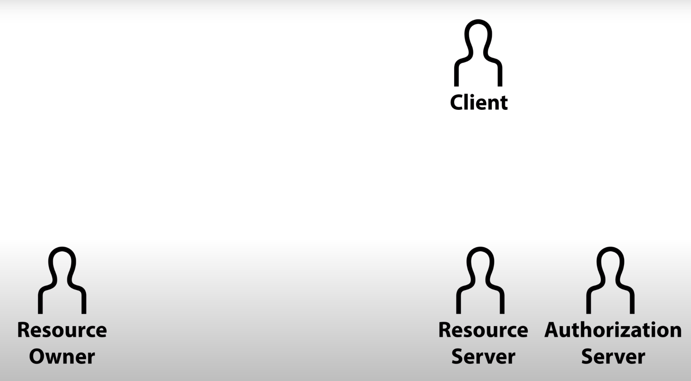

### 1. **Resource Owner**
- 고객, 사용자

<br/>

### 2. **Client**
- 나의 서비스

<br/>

### 3. **Resource Server**
- 구글, 페이스북, 네이버 등 고객의 정보를 제공하는 곳

<br/>

### 4. **Authorization Server**
1. 인증 관련한 처리를  하는 서버
2. 공식 문서에는 Resource / Authorization 두 가지 서버로 나눠져 있음
3. 여기선 간단한 설명을 위해 Resource Server로 합쳐서 설명

<br/>

## Register

### 1. 사전에 승인을 받아 놓아야 한다.

<br/>

### 2. 등록하는 방법은 각 Resource Server마다 다르지만 공통적인 세가지
1. Client ID
    1. 우리가 만들고 있는 애플리케이션을 식별하는 식별자.
    2. 노출되어도 상관 없다.

<br/>

2. Client Secret
    1. 비밀번호
    2. 절대로 외부에 노출되면 안된다.

<br/>

3. Authorized redirect URLs
    1. Authorized : 권한을 부여하다.
    2. Resource Server가 권한을 부여하는 과정에서 Authorize Code를 전달해준다.
    3. 그 때 이 주소로 전달해 달라고 알려준 것.
    4. Resource Server는 다른 주소에서 요청을 하면 거부를 할 것이다.

<br/>

4. 각 Resource Server에 등록하는 방법은 생략
    1. 구글에서 검색해서 사용

<br/><br/>

## OAuth 작동 흐름

### 1. 고객의 정보를 사용하겠다는 동의가 필요하다.
- 각 Resource Server에 맞는 버튼을 클릭하는 것으로 동의를 얻는 것

<br/>

### 2. 그러면 아래와 같은 주소로 요청을 보낸다.
- scope의 경우에는 Resource Server에서 제공하는 기능 중 사용하고자 하는 기능

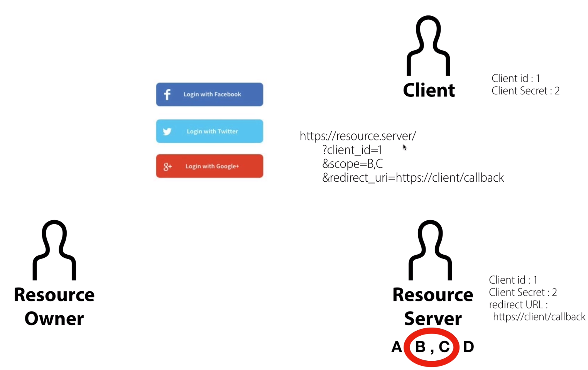

<br/>
    
### 3. Resource Owner가 Resource Server로 요청을 보내게 되면
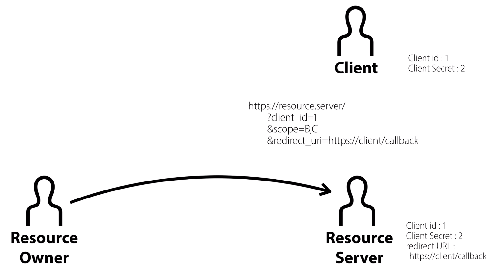

<br/>

### 4. Resource Server는 로그인이 되어 있는지 확인하고 안되어 있으면 로그인 화면을 보낸다.

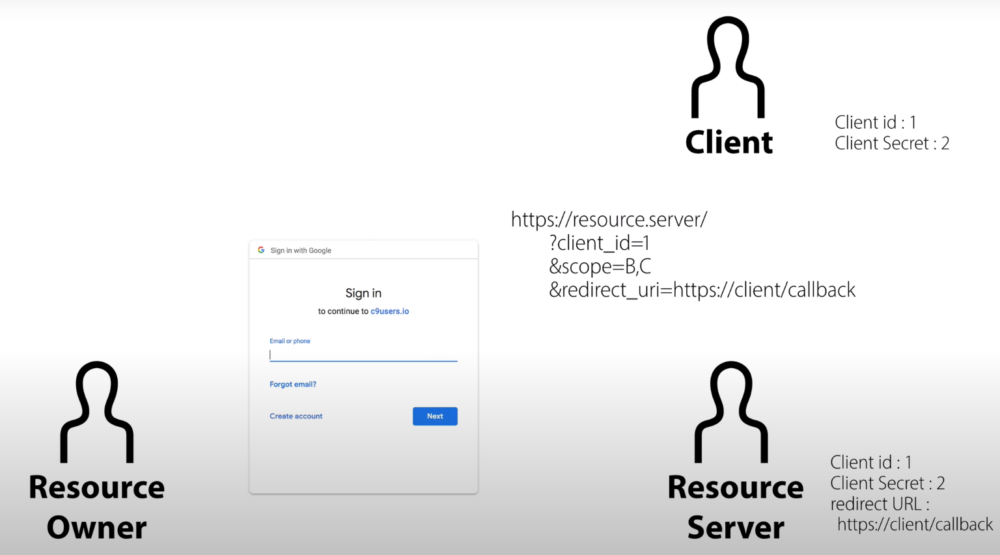

<br/>

### 5. 이후, 로그인 후 다시 요청이 들어오면 그때서야 Client Id와 redirect URL이 같은지 확인한다.

<br/>

### 6. 다르면 종료하고, 같으면 Client에게 Scope와 같은 기능 제공하는 것을 동의하는지를 묻는 페이지를 다시 보낸다.
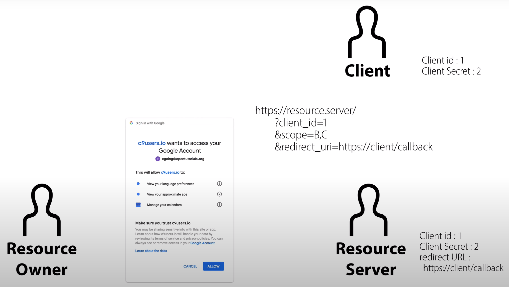

<br/>

### 7. 동의를 하게 되면 Resource Server는 다음과 같은 user id와 제공한 기능을 저장해둔다.
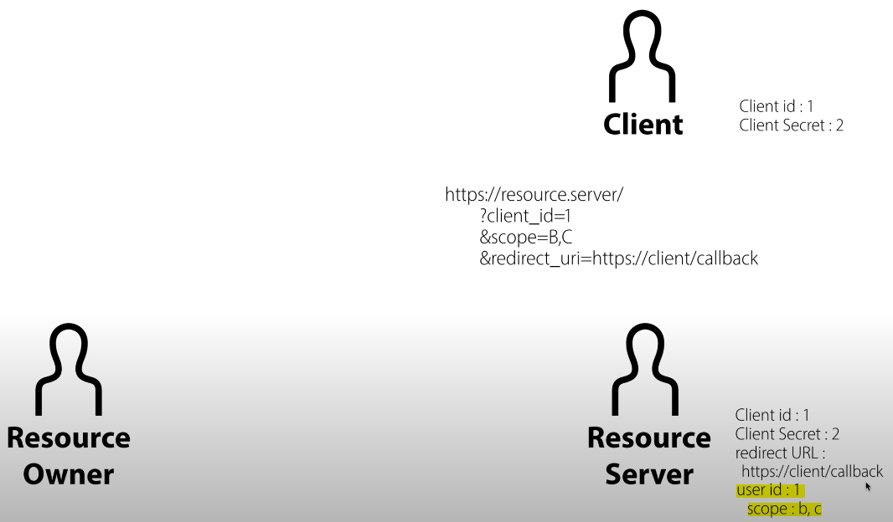

<br/>

### 8. 이후 Client에게 바로 accessToken을 발급하지 않고 임시 비밀번호를 발급한다.

<br/>

### 9. authorization code를 Resource Owner에게 전송한다.
1. Location : https://client/callback?code=3
2. Header에 Location 붙여서 보냄, 의미는 Redirection 
3. Resource Server가 Resource Owner 브라우저에게 위의 주소로 이동하라고 명령을 내린 것

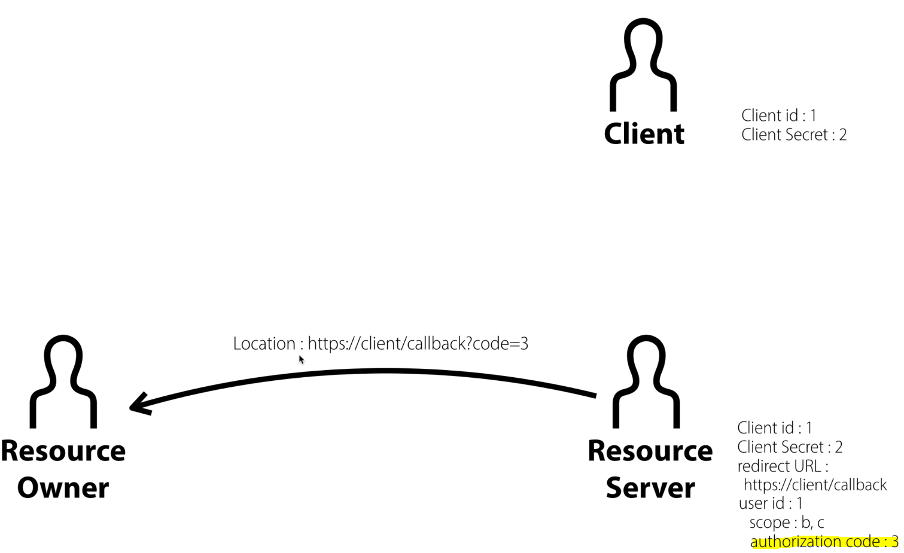

<br/>

### 10. Resource Owner의 브라우저가 Header Location의 명령에 따라 Client에게 요청을 보낸다.

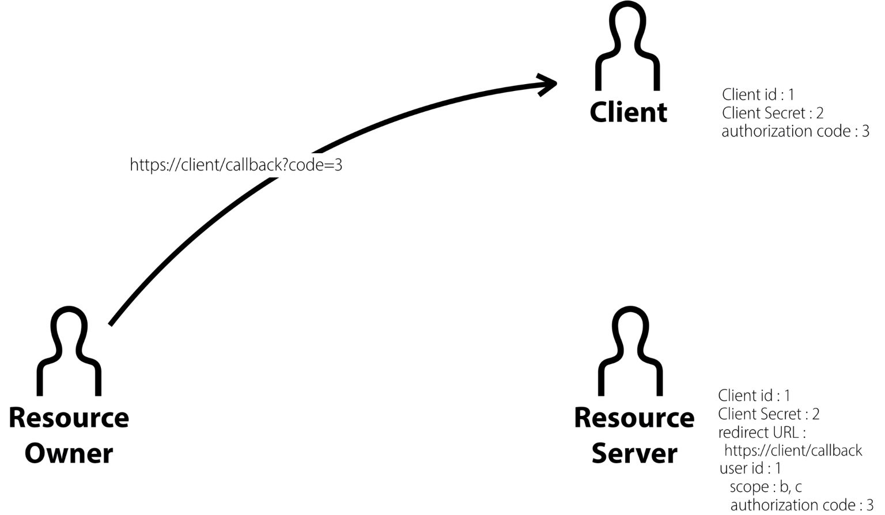

<br/>

### 11. 그러면 Client는 Resource Server에게 자신이 가진 4가지 정보를 보낸다
1. Client Id, Client Secret, redirect URL, authorization code
2. 이러한 [authorization code를 이용하는 방법을 포함한 4가지 방법](#토큰-발급-방식(grant-type)은-총-4가지)이 있다.

<br/>

### 12. 4가지가 모두 일치하는지 확인 후에 access Token을 발급 한다.

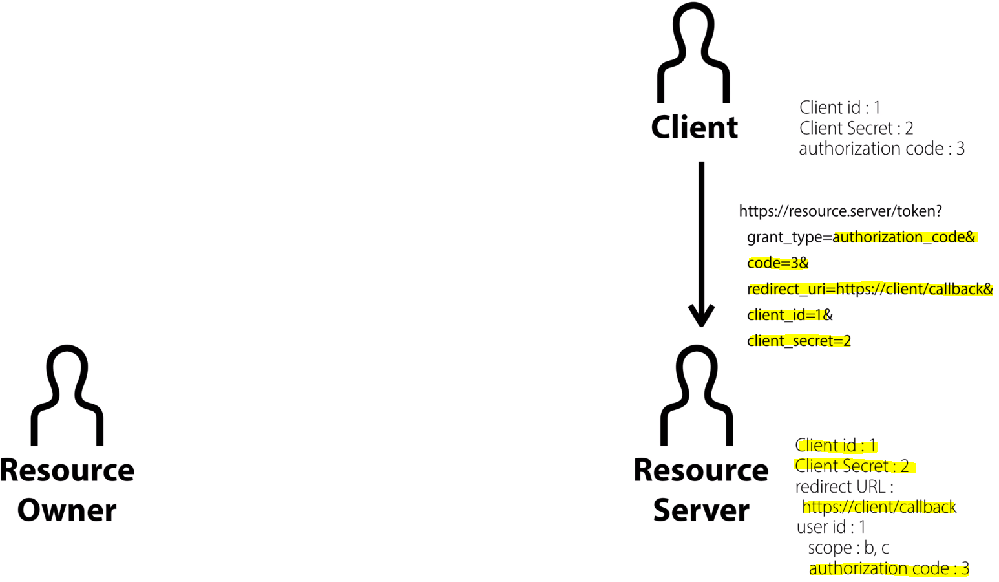

### 13. 인증 후에 authorization code를 Client와 Resource Server에서 지운다.

<br/>

### 14. 그리고 AccessToken을 발급 해준다.

<br/>

### 15. Client가 AccessToken으로 접근을 할 때 다음과 같은 것을 보장한다.
- user id 1을 가진 사용자의  대한 정보, 유효한 기능 b, c를 accessToken 4를 가진 Client 허용

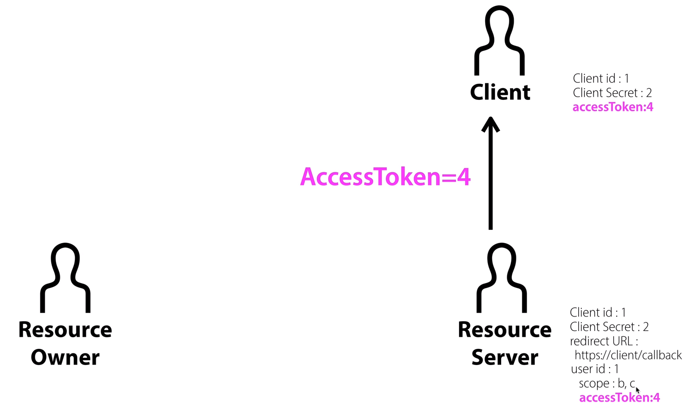

<br/><br/>


## 토큰 발급 방식(grant type)은 총 4가지

- 기본적으로 헤더에 authorization 값(clientid:secretkey base64 인코딩한 값)을 넣어서 요청

<br/>

### 1. code (code를 발급받고 code로 access token 발급)

1. code 발행
    - 아래 url은 기본 oauth2.0 코드 발급 URI로 절차 완료시 redirect_uri 로 code 가 발행된다.
    - URL : http://localhost:8080/oauth/authorize
    - Parameter
        - response_type=code
        - redirect_uri=코드 전달받을 URL
        - scope=read

<br/>

2. access token 발행
    - 발급 받은 코드를 가지고 token 을 발행 한다.
    - URL : http://localhost:8080/oauth/token
    - Parameter
        - grant_type=code
        - authorization_code=발급받은코드
        - redirect_uri=코드 전달받은 URL

<br/>

### 2. password (id, pw 로 access token 발급)

- access token 발행
    - id, pw 로 토큰을 바로 발급 받을 수 있다.
    - URL : http://localhost:8080/oauth/token
    - Parameter
        - grant_type=password
        - username=아이디
        - password=패스워드
        - scope=read

<br/>

### 3. client_credentials (바로 access token 발행)

- 다른 정보를 요하지 않고 authorization 에 clientid, secret key만 등록된 정보면 바로 발행
- 그런 특성으로 정말 별다른 인증 필요 없는 신뢰도가 높은 클라이언트에게만 해당 방식을 허용
- 해당 방식은 별다른 인증을 요하지 않기에 위험성이 있어 refresh_token은 따로 발행 하지 않음
- URL : http://localhost:8080/oauth/token
- Parameter
    1. grant_type=client_credentials
    2. scope=read
    

<br/>

### 4. refresh_token (refresh token으로 access token 발행)

- 해당 방식은 1, 2번으로 인증 후 재 로그인 없이 자동 로그인을 구현하기 위함
- 1,2 방식으로 access_token 발행과 동시에 refresh_token 도 같이 발행해주기에 얻은 refresh token로 token 발행이 가능하다.
- URL : http://localhost:8080/oauth/token
- Parameter
    1. grant_type=refresh_token
    2. refresh_token=이전에 발급받은 refresh token
    3. scope=read

<br/>

## Refresh Token
1. Access Token은 수명이 있다.
    - 짧으면 몇 시간, 길게는 60일 90일 단위로 살아있다.
    - 수명이 끝나면 더 이상 API에 접속해도 데이터를 주지 않는다.

<br/>

2. 수명이 끝날 때 마다 Access Token을 다시 발급하게 하는 과정을 사용자에게 겪게 하면 불편

<br/>

3. oauth 2.0 RFC 
    - RFC는 인터넷과 관련된 여러가지 표준안
    - [https://datatracker.ietf.org/doc/html/rfc6749#section-1.5](https://datatracker.ietf.org/doc/html/rfc6749#section-1.5)

<br/>
    
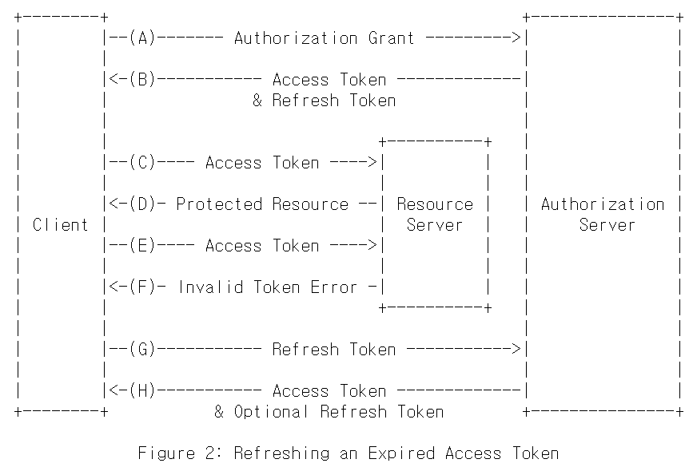
    
### 1. A : 권한을 획득 / 허가 한다.
<br/>

### 2. B : Access / Refresh Token 둘 다 발급 받는다.
<br/>

### 3. C : Access Token으로 인증
<br/>

### 4. D : 보호되고 있는 자원
<br/>

### 5. E : Access Token으로 인증
<br/>

### 6. F : 인증되지 않은 토큰
<br/>

### 7. G : Refresh Token으로 인증
<br/>

### 8. H : Access Token 다시 발급 받는다.
- Refresh Token도 다시 발급 되는 곳도 있다.
- **Google Doc - Refreshing an access token**
```json
// Request
POST /token HTTP/1.1
Host: oauth2.googleapis.com
Content-Type: application/x-www-form-urlencoded

client_id=your_client_id&
client_secret=your_client_secret&
refresh_token=refresh_token&
grant_type=refresh_token

// Response
{
    "access_token": "1/fFAGRNJru1FTz70BzhT3Zg",
    "expires_in": 3920,
    "scope": "https://www.googleapis.com/auth/drive.metadata.readonly",
    "token_type": "Bearer"
}
```

## 기술 구현

<br/>

## 참조한 사이트
1. https://deeplify.dev/back-end/spring/oauth2-social-login

2. https://velog.io/@swchoi0329/스프링-시큐리티와-OAuth-2.0으로-로그인-기능-구현#5-세션-정장소로-데이터베이스-사용하기

<br/>

## Front End 구현
- 요청을 보내는 URL & Redirect URL
``` html
<!-- 구글 -->
<a class="social_btn" href="https://localhost:8080/oauth2/authorization/google?redirect_uri=https://localhost/oauth/redirect"></a>

<!-- 네이버 -->
<a class="social_btn" href="https://localhost:8080/oauth2/authorization/naver?redirect_uri=https://localhost/oauth/redirect"></a>

<!-- 카카오 -->
<a class="social_btn" href="https://localhost:8080/oauth2/authorization/kakao?redirect_uri=https://localhost/oauth/redirect"></a>

```

<br/>

## Back End 구현

### 1. aplication properties, gradle 설정 내용 생략
<br/>

### 2. SecurityConfig에 요청을 받는 코드를 구현
```java
public class SecurityConfig extends WebSecurityConfigurerAdapter {
   
   ...

    @Override
    protected void configure(HttpSecurity http) throws Exception {
        http

                ...
                // 인증이 필요한 부분 구글 oauth2Login부분
                .antMatchers("/oauth2/authorization/**").authenticated() 
                .and()
                .logout()
                .logoutSuccessUrl("/")
                .and()
                .oauth2Login()
                .userInfoEndpoint()
                .userService(customOAuth2UserService)
                .and()
                .successHandler(oAuth2AuthenticationSuccessHandler)
                .failureHandler(oAuth2AuthenticationFailureHandler);
    }
}
```

<br/>

### 3. CustomOAuth2UserService 구현하여 토큰 및 회원가입 자동 처리
```java
public class CustomOAuth2UserService implements OAuth2UserService<OAuth2UserRequest, OAuth2User> {

    private final UserRepository userRepository;

    @Override
    public OAuth2User loadUser(OAuth2UserRequest userRequest) throws OAuth2AuthenticationException {
        OAuth2UserService delegate = new DefaultOAuth2UserService();
        OAuth2User oAuth2User = delegate.loadUser(userRequest);

        // 구글 / 네이버 / 카카오 로그인인지 구분용
        String registrationId = userRequest.getClientRegistration().getRegistrationId();

        // 제공 타입
        String userNameAttributeName = userRequest.getClientRegistration()
                .getProviderDetails().getUserInfoEndpoint().getUserNameAttributeName();
                
        // 유저 토큰
        String userToken = userRequest.getAccessToken().getTokenValue();
        
        ...

        return new DefaultOAuth2User(
                Collections.singleton(new SimpleGrantedAuthority(user.getRoleKey())),
                attributes.getAttributes(),
                attributes.getNameAttributeKey());
    }
}
```

<br/>

### 4. OAuth2AuthenticationSuccessHandler / OAuth2AuthenticationFailureHandler 구현하여 성공, 실패결과 리턴
```java
@Component
public class OAuth2AuthenticationSuccessHandler extends SimpleUrlAuthenticationSuccessHandler {

    @Autowired
    private UserRepository userRepository;

    @Override
    public void onAuthenticationSuccess(HttpServletRequest request, HttpServletResponse response,
                                        Authentication authentication) throws IOException {
            
        ...

        String url = makeRedirectUrl(JwtTokenUtil.getToken(user.getEmail()));

        getRedirectStrategy().sendRedirect(request, response, url);
    }

    private String makeRedirectUrl(String token) {
        return UriComponentsBuilder.fromUriString("https://localhost:8080/oauth/success")
                .queryParam("accessToken", token)
                .build().toUriString();
    }

}
```

<br/><br/>

## Trouble Shooting

<br/>

### 오류 원인
1. Redirect가 성공하여 Token은 정상적으로 넘어갔으나 액션이 동작하지 않는 다는 페이지가 나왔다.
2. 우선 FrontEnd, BackEnd 통합 빌드 배포가 아니다.
3. FrontEnd, BackEnd 각각, Docker 컨테이너 이미지로 따로 돌아간다.
4. 서로 Port 번호가 다름
    - FronEnd : 443
    - BackEnd : 8443
5. SuccessHandler, FailureHandler에서 Redirect를 할 때 포트 번호가 달라 문제가 생겼다.


<br/>

### 해결 방법
1. SuccessHandler에 redirect하는 부분에 도메인:443/oauth/success로 직접 포트 지정
2. Failure도 같은 방식으로 바꿔, 정상적으로 동작하도록 수정


<br/><br/><br/>

# WebRTC

## WebRTC


- 웹 애플리케이션과 사이트가 중간자 없이 브라우저 간에 오디오나 영상 미디어를 포착하고 마음대로 스트림할 뿐 아니라, 임의의 데이터도 교환할 수 있도록 하는 기술입니다.

- 구글이 오픈소스화한 프로젝트에서 기원하였으며, 그 뒤로 국제 인터넷 표준화 기구(IETF)가 프로토콜 표준화 작업을, W3C가 API 정의를 진행하였으며, 음성 통화, 영상 통화, P2P 파일 공유등으로 활용될 수 있습니다.

<br/><br/>

## OpenVidu
- WebRTC 기술을 이용해 미디어 전송을 할 수 있는 크로스 플랫폼 프레임워크로, 웹 또는 모바일 애플리케이션에서 화상통화를 쉽게 추가할 수 있는 플랫폼입니다.

- WebRTC 미디어 서버를 구현하는 데 소모되는 리소스를 절약해서 빠르게 실시간 통신을 추가할 수 있도록 도와주는 것이 큰 장점입니다.

<br/>

### Openvidu는 크게 두 파트로 나눌 수 있고 다음과 같습니다.

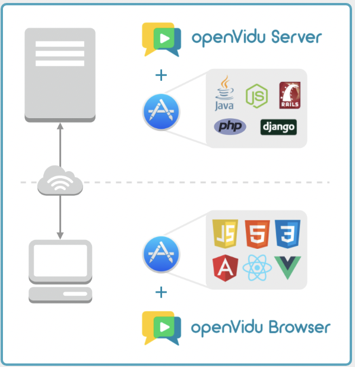

### Openvidu Browser
- 클라이언트 측에서 사용할 라이브러리
- 화상 통화를 만들고, 비디오와 오디오를 주고받을 수 있게끔 도와줍니다.
- Openvidu에서 사용할 수 있는 모든 작업은 Openvidu 브라우저를 통해 관리됩니다.

<br/>

### Openvidu Server
  - 서버 측 내용을 처리하는 애플리케이션
  - Openvidu 브라우저에서 작업을 수신하고, 비디오 통화를 설정하고, 관리하는 데 필요한 모든 작업을 수행합니다.
  - 명시적으로 구현할 필요는 없고, 실행한 뒤에 접근할 수 있는 IP 주소만 알고 있으면 됩니다.

<br/><br/>

## 적용
- 늘비상담은 사용자에게 실시간 화상 통화를 통한 고민 해소 솔루션을 제공합니다.
- 이러한 이유로 웹 브라우저 간에 플러그인의 도움 없이 서로 통신할 수 있는 WebRTC를 채택하였습니다.
- 또, OpenVidu는 다양한 프레임워크 특히 Vue와의 호환성이 높기 때문에 프로젝트의 손쉬운 적용을 위해 사용하였습니다.

<br/><br/>

## Trouble Shooting
- EC2 서버에 온프로미스 방식으로 openvidu 서버 배포
- 화상 채팅 입장/채팅 기능/이모지 기능은 가능하나, 상대방의 비디오, 오디오가 출력되지 않는 상황
- Error : OpenVidu 접속 오류(CONNECT REFUSED)

<br/>

### 오류 원인: coturn 서버 문제
- OpenVidu 서버 http 포트를 변경해도 적용되지 않고, 80번 포트를 차지함. 

<br/>

### 해결 방법: http 포트 변경을 통한 해결
- 포트 이슈 해결을 위해 기존 프론트엔드가 가지고 있던 http 포트를 변경하여 해결함.


<br/><br/><br/>


# Chatting System

## Web Socket

<br/>

### Web Socket이란?

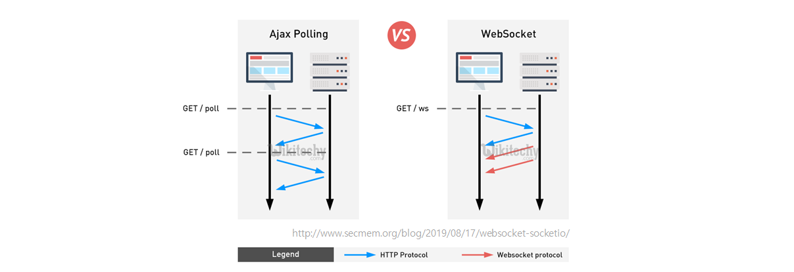

- 웹 서버와 웹 브라우저간 실시간 양방향 통신환경을 제공해주는 실시간 통신 기술입니다.
- HTTP와 달리 완전한 이중 통신을 사용하여 Web Socket이 TCP에서 메시지를 스트리밍 할 수 있습니다.
- 양방향으로 원할때 요청을 보낼 수 있으며 stateless한 HTTP에 비해 오버헤드가 적으므로 유용하게 사용할 수 있습니다.

<br/>

### Web Socket의 필요성

- 실시간 양방향 데이터 통신이 필요한 경우
- 많은 수의 동시 접속자를 수용해야 하는 경우
- 브라우저에서 TCP 기반의 통신으로 확장해야 하는 경우
- 개발자에게 사용하기 쉬운 API가 필요할 경우
- 클라우드 환경이나 웹을 넘어 SOA 로 확장해야 하는 경우

<br/>

### Web Socket 접속 과정
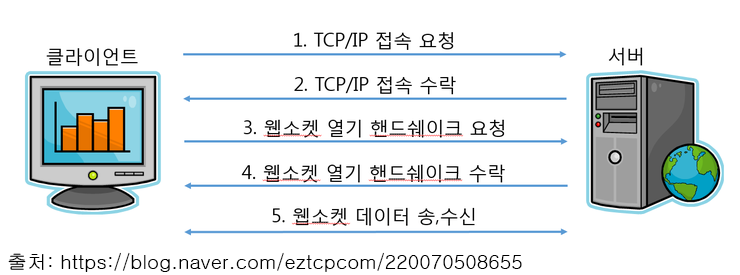
- 웹소켓을 이용하여 서버와 클라이언트가 통신을 하려면 먼저 웹소켓 접속 과정을 거쳐야 한다.
- 웹소켓 접속 과정은 TCP/IP 접속 그리고 웹소켓 열기 HandShake 과정으로 나눌 수 있다.
- 웹소켓도 TCP/IP위에서 동작하므로, 서버와 클라이언트는 웹소켓을 사용하기 전에 서로 TCP/IP 접속이 되어있어야 한다.
- TCP/IP 접속이 완료된 후 서버와 클라이언트는 웹소켓 열기 HandShake 과정을 시작한다.

<br/>

### 웹소켓 열기 HandShake
- 클라이언트가 먼저 HandShake 요청을 보내고 이에 대한 응답을 서버가 클라이언트로 보내는 구조이다.
- 서버와 클라이언트는 HTTP 1.1 프로토콜을 사용하여 요청과 응답을 보낸다.
- 아래는 Request와 Response의 예시이다.

<br/>

### HandShake Request
- <b> GET </b> /chatHTTP/1.1 <br>
- <b> Host </b> : server.gorany.org<br>
- <b> Upgrade </b> : websocket<br>
- <b> Connection </b> : Upgrade<br>
- <b> Sec-WebSocket-Key </b> : dGhlIACqbSBcZQBub27jWG==<br>
- <b> Origin </b> : http://localhost:8080<br>
- <b> Sec-WebSocket-Version </b> : 13 <br>

<br/>

### HandShake Response
- <b> HTTP/1.1 101 </b> SwitchingProtocols
- <b> Upgrade </b> : websocket
- <b> Connection </b> : Upgrade
- <b> Sec-WebSocket-Accept </b> : s3pPWEBhTxaQ9kYSizhZRbH+xPo=

<br><br>

## SockJS
- SpringFramework에서의 Web Socket을 활용할 때, 자바 개발자들이 socket.io를 쓸 수 없는 문제를 해결하기 위한 방법
- 자체 스팩으로 Web Socket에서 지원하지 못하는 브라우저 부분을 관리한다.
- 서버 개발 시 Spring 설정에서 일반 Web Socket으로 통신할 지 SockJS 호환으로 통신할 지 결정할 수 있으며, 클라이언트에서는 SockJS 클라이언트를 통해 서버와 통신한다.

<br>

### <b>SockJS의 구성</b>
- <b> SockJS Protocol </b> <br>
- <b> SockJS Javascript Client </b> - 브라우저에서 사용되는 클라이언트 라이브러리 <br>
- <b> SockJS Server </b> 구현 - Spring-websocket 모듈을 통해 제공 <br>
- <b> SockJS Java Client </b> - Spring-websocket 모듈을 통해 제공 (<b>Spring ver.4.1</b> ~) <br>

<br>

### SockJS의 전송 타입
<ol>
 <li> <b>WebSocket</b>
 <li> <b>HTTP Streaming</b>
 <li> <b>HTTP Long Polling</b>
</ol>
<br><br>

### SockJS Client
- SockJS Client는 서버의 기본 정보를 얻기 위해 "<b>GET/info</b>"를 호출한다.
- 서버가 WebSocket을 지원하는지, 전송 과정에서 Cookies 지원이 필요한지, 그리고 OCRS를 위한 Origin 정보 등의 정보를 응답으로 전달 받는다.
- 모든 전송 요청은 다음의 URL 구조를 갖는다.
  - https://host:prot/myApp/myEndpoint/{server-id}/{session-id}/{transport}
  - server-id : 클러스터에서 요청을 라우팅하는데 사용하나 이외에는 의미 없음
  - session-id : SockJS session에 소속하는 HTTP 요청과 연관성 있음
  - transport : 전송 타입 (예 : websocket, xhr-streaming, xhr-polling)

<br>

### SockJS Enabling
``` java
    public void registerStompEndpoints(StompEndpointRegistry registry) {
        registry.addEndpoint("/chat")
                .setAllowedOriginPatterns("*")
                .withSockJS();
                // webSocketConfig에서 SockJS를 가능하게 하기 위해
                // .withSockJS()를 추가해준다.
                // setAllowedOriginPatterns("*")에서 * 라는 와일드 카드를 사용하면
                // 보안상의 문제로 전체를 허용하는 것보다 직접 하나씩 지정해 주어야 한다고 한다.
    }
```
(여기 사이에 나눌 말이 들어가면 좋겠음)

```javascript
const connect = async function () {
      let socket = new SockJS("https://localhost:8080/chat");
      state.stompClient = Stomp.over(socket);
      await state.stompClient.connect(
        {},
        (frame) => {
          state.socketConnected = TextTrackCue;
          state.stompClient.subscribe("/send", (res) => {
            store.dispatch("root/chatRoomGetList", {
              userId: state.userInfo.id,
            });
            state.recvList.push(JSON.parse(res.body));
          });
        },
        (error) => {
          state.socketConnected = false;
        }
      );
    };
    // 프론트 쪽에서는 서버의 포트번호와 맞게 8443으로 지정해 주었다.
```

<br>

### 허용된 Origins
- Origin은 <b>Protocol, Host, Port<b> 3개 부분으로 구성된다.
- http://localhost:8080/
  - protocol : http
  - host : localhost
  - port : 8080
- <b> 3개 부분이 모두 동일한 경우만 동일한 Origin이라고 말한다. </b>
- Springframework 4.1.5를 기준으로 WebSocket 및 SockJS의 기본 동작은 동일한 Origin요청만 수락하는 것이다. 
- 모든 목록이나 특정 목록을 허용하는 것도 가능하다. 다음의 3가지 행동을 취할 수 있다.
    - <b> 동일한 오리진 요청만 허용(default) </b>
        - 이 모드에서는 SockJS가 활성화되면 iframe HTTP 응답 헤어 X-Frame-Options가 'SameOrigin'으로 설정된다. 
        - JSONP 전송은 요청의 오리진 확인이 불가능하므로 비활성화된다. 따라서 이 모드가 활성화된 경우 IE 6,7은 지원되지 않는다.
    - <b> 지정된 Origin 목록 허용</b>
        - 이 모드에서는 지정된 Origin은 반드시 http:// or https://로 시작해야 한다. 
        - 이 모드에서 SockJS가 활성화되면 iframe 전송이 비활성화되므로 IE 6~9까지는 지원되지 않는다.

    - <b> 모든 Origin 허용 </b>
        - 이 모드를 사용하면 허가된 오리진 값으로써 "*"를 사용해야 한다. 이 모드에서는 모든 전송(Send)를 사용할 수 없다.

<br/><br/>

## STOMP
- 텍스트 기반의 메세징 프로토콜이다.
- TCP나 Web Socket과 같은 신뢰성 있는 양방향 Streaming Network Protocol에서 사용 가능하다.

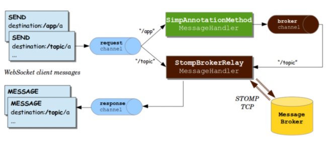

- STOMP는 구독이라는 개념을 통해 내가 통신하고자 하는 주체를 판단하여 브로커라는 개념을 두어 실시간으로 계속 관심을 가지며 아래와 같은 요청들을 처리하게 된다.

<br/>

### Connect

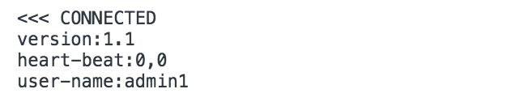

- 연결에 관한 구조
- **버전 정보**와 현재의 세션 정보를 가져온다.

<br/>

### Subscribe

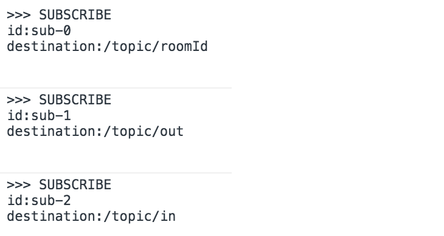

- 구독이라는 개념을 이용해 현재 메세지에 대한 목적지를 설정한다.

- Connect 이후에 Subscribe를 설정하게 된다.
- 등록되지 않은 Subscribe를 호출 시 찾을 수 없기에 정확한 통신이 되지 않는다.

<br/>

### Message

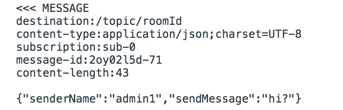

- 메세지를 전송할 때의 구조이다.
- 메세지의 전달지와 해당 메세지의 정보들이 출력된다.
- 다양한 데이터 타입을 가질 수 있다.

<br/>

### Disconnect


- 연결을 종료했을 때의 구조이다.
- 통신 상태에 따라서 정해진 구조를 가지고 통신을 하게 된다.


<br/><br/><br/>


# S3(Simple Storage Service)
- AWS에서 제공하는 객체 스토리지 서비스

- 서비스 과정에서 사용되는 프로필 이미지 파일들을 업로드 하여 관리하기 위해서 사용

<br/>

### 1. AWS S3 bucket 생성
``` yml
  1. [AWS -> S3 -> 버킷 만들기]에서 새로운 버킷을 만든다.
  2. 퍼블릭 액세스를 허용해준다.
  3. 권한 -> 버킷 정책으로 들어가서 정책을 설정한다.
  
  {
      "Version": "2012-10-17",
      "Id": "Policy1644805559372",
      "Statement": [
          {
              "Sid": "Stmt1644805556206",
              "Effect": "Allow",
              "Principal": "*",
              "Action": [
                  "s3:GetObject",
                  "s3:PutObject"
              ],
              "Resource": "arn:aws:s3:::[버킷 이름]/*"
          }
      ]
  } 
```

<br/>

### 2. AWS IAM 사용자 생성
```Text
  AWS 액세스 유형 : 프로그래밍 방식 액세스

  권한 설정 : AmazonS3FullAccess 선택

  AccessKey와 Secret Key 저장
```

<br/>

### 3.  build.gradle에 의존성 추가
```gradle
  implementation("io.awspring.cloud:spring-cloud-aws-context:2.3.3")

  implementation("org.springframework.cloud:spring-cloud-aws-autoconfigure:2.2.6.RELEASE")
```

<br/>

### 4. s3 config 파일 추가
```java
  public AmazonS3Client amazonS3Client() {
      BasicAWSCredentials awsCreds = new BasicAWSCredentials(accessKey, secretKey);
      
      return (AmazonS3Client) AmazonS3ClientBuilder.standard()
              .withRegion(region)
              .withCredentials(new AWSStaticCredentialsProvider(awsCreds))
              .build();
  }
```

<br/>

### 5. S3 service 클래스 추가

```java
  public String upload(MultipartFile uploadFile) throws IOException { ... }

  public void deleteFile(String fileName) { ... }

  private static String getUuid() { ... }

  private void uploadOnS3(final String findName, final File file) { ... }

  public String findImg(String img) { ... }

```